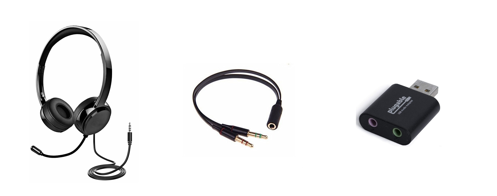

## Intro
Some of my co-workers have struggled with the distinction between function *composition*  and *piping* values into a function. The two operations are closely related, so the confusion is understandable.

In this post I'll try to clarify the difference.

## The Quick, Less Insightful Explanation
You *could* think of composition as simply shorter notation for piping. Consider the following example of piping:

 ```fsharp
let isBig num =    // int -> bool
    num > 50

let inputStringIsBig =    // string -> bool
    fun input ->
        input
        |> String.length
        |> isBig
 ```

Notice how the parameter, `input`, is explicitly passed around in `inputStringIsBig`. In contrast, you could use composition to get an identical function with less code:

```fsharp
let inputStringIsBig' = String.length >> isBig    // string -> bool
```

Note how both functions have the signature `string -> bool`; indeed the behaviors of `inputStringIsBig` and `inputStringIsBig'` are identical. Yet with composition we can create the behavior more concisely.

## The Longer, More Insightful (Hopefully) Explanation
You could eke by with the quick explanation, but I think it's far less useful and interesting than a fuller understanding.

Let's foster some intuition by using a non-programming example. Recently, the headphone jack on my laptop stopped working. I had a headset that I needed for Zoom meetings. Unfortunately, the headset had an 8th inch jack, and the only operating ports on my laptop were USB. Luckily, I had the following at my disposal:



The solution to my problem should be obvious. Plug the splitter into the USB adapter, and I now have a new adapter that I can use to connect my headset to my laptop.

Now, let's return to function composition. Functional programming is all about.... *FUNCTIONS*! Functions are the fundamental building blocks of a functional program. Composition is about taking existing functions and sticking them together to build new functions.

Think of the two adapters above as functions (note the signatures in dark grey):
```fsharp
let eighthInchToSplitAdapter =    // EighthInchJack -> SplitJack
    ...

let splitJackToUsbAdapter =       // SplitJack -> USB
    ...
```

I need an adapter (or function) that can go from the 8th inch jack on my headset, to the USB port on my laptop. So, I'll *compose* the above functions into a new adapter:
```fsharp
let headSetConnector =     // EighthInchJack -> USB
    eighthInchToSplitAdapter >> splitJackToUsbAdapter
```

Of course, we could have used piping to achieve the same thing:

```fsharp
let headSetConnector' headphoneJack =    // EighthInchJack -> USB
    headphoneJack
    |> eighthInchToSplitAdapter
    |> splitJackToUsbAdapter
```

The signatures are identical, so in a way piping and composition are two sides of the same coin. However, I think there's a difference that goes beyond terser syntax. It's a difference in mentality. When you're thinking in terms of composition, you're thinking in terms of *inputs and outputs*, in terms of how functions can be used to build new functions. This is made clear by looking at how the `>>` operator is defined:

```fsharp
let (>>) f g x = g ( f(x) )
```

When you use piping, on the other hand, you're thinking in terms of values --- taking in a value, performing some operations on it, and returning a new value. This is clear when looking at its definition: ```let (|>) x f = f x```

You're more likely to use piping in a situation where you're interested in getting a value rather than creating a new behavior. For example:

```fsharp
let nameIsLong =     // bool = true
    "Kiefer William Frederick Dempsey George Rufus Sutherland"
    |> String.length
    |> isBig
```

You could technically still use composition to get a value, but it's less natural:

```fsharp
let nameIsLong' =     // bool = true
    (String.length >> isBig) "Kiefer William Frederick Dempsey George Rufus Sutherland"
```

If instead you're trying to create a reusable behavior, it is often more natural to do so in terms of composition, as we saw with `headSetConnector`. That said, it is not *always* better to use composition over piping when defining a new function. For example, you may not have all the functions you need to create the desired behavior. You could write additional helper functions before you compose your desired function, but if those behaviors are particular to this one use case, abstracting them may only cause confusion.

### When to Use Piping vs Composition
I tend to favor composition over piping in two scenarios.

#### 1. Anonymous Functions on the Fly

```fsharp
Html.input [
    prop.type' "text"
    prop.onChange (int >> Msg.UserChangedNumber >> dispatch)
]
```

Compare this to using piping:
```fsharp
Html.input [
    prop.type' "text"
    prop.onChange (fun input -> input |> int |> Msg.UseChangedNumber |> dispatch)
]
```


#### 2. Simple Combination of Discrete Functions
```fsharp
let getLengthOfWords =    // string -> int
    String.split " "
    >> List.map String.trim
    >> List.map String.length
    >> List.sum
```

Strictly speaking, however, there is no definitively right or wrong time to use one over the other. Just understand both and use whatever feels best for the given use case.
