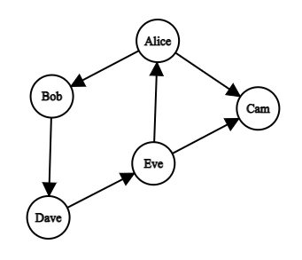

# Introduction

Welcome to the fifth installment of a series on solving common programming interview questions using functional programming!

As previously mentioned, I started this series while searching for a new job. I was fortunate enough to receive a position with [ArborXR](https://arborxr.com/) in May, so the series has been on hiatus since then. My original plan was to gradually work through more and more difficult problems, eventually tackling graph problems.

However, since I've already secured a job, I've decided to jump ahead to the graph problems. In this post, I will cover the basic concepts of graphs and how to traverse them in a functional programming style. In future posts we'll use these concepts to solve interview problems in a functional programming style.

# Graphs
Graphs are a data structure that can be used to represent relationships between different pieces of data. You've probably seen them before in things like social network diagrams or maps, where they're used to show connections between people or locations.

A graph consists of a set of **nodes** (also known as vertices) and a set of **edges** connecting those nodes. Consider the subway map below:

 [POP]Image by <a href="https://www.freepik.com/free-photo/geometric-metro-map-with-pinpoint_5003381.htm#query=subway%20map&position=0&from_view=search&track=sph">Freepik</a>[/POP]

We could model this map as a graph by thinking of the stations as nodes and the rail lines as edges.

## Types of Graphs

Graphs can be classified based on the properties of their vertices and edges. Different classifications will have different implications for how you work with them.

### Directed and Undirected Graphs

Imagine you have a group of coworkers. You can represent the power dynamics between them using a graph. If you want to show the directionality of the relationships (i.e., who reports to whom), you can use a **directed graph**. This is like a one-way street: e.g., Alice might be the boss of Bob, but that doesn't mean Bob is the boss of Alice. We use **arrows as the edges** of a _directed_ graph:


On the other hand, if you just want to show that there is a connection between two people and the direction doesn't matter, you can use an **undirected graph**. This is like a two-way street: Eve is friends with Bob, and Bob is also friends with Eve. We use **lines as the edges** of an _undirected_ graph:


### Cyclic and Acyclic Graphs
A cyclic graph is a graph that contains at least one cycle, which is a path that starts and ends at the same vertex, passing through other vertices along the way. For example, consider the following graph:



In this graph, there is a cycle formed by the path Alice -> Bob -> Dave -> Eve -> Alice. This means that it is possible to start at Alice, follow the edges of the graph, and eventually end up back at Alice again.

On the other hand, an acyclic graph does not contain any cycles. This means that it is not possible to start at a vertex and follow the edges of the graph to end up back at that same vertex. For example, the following graph is acyclic:


> Both cyclic and acyclic graphs can be either directed or undirected. An undirected graph is not considered cyclic if it requires going through the same vertex twice to form a cycle.

<br/>

## Representing Graphs with Code

In order to solve graph problems programatically, we need a way to represent them with code. Let's use this graph as an example:


There are different ways to represent a graph, but we'll cover two of the most common; **edge lists** and **adjacency lists**.

### Edge Lists
An **edge list** is a collection of pairs of nodes that are connected by an edge. In the case of a directed graph, the first node in the pair is the source node and the second node is the destination node. In the case of an undirected graph, the order of the nodes doesn't matter.

In F#, you could represent our example graph as an edge list like this:

```fsharp
let edgeList: (string * string) list =
    [
        "a", "b"
        "a", "c"
        "a", "e"
        "c", "d"
        "c", "e"
        "d", "b"
    ]
```

It's important to keep in mind whether the list represents a directed or undirected graph. It can be useful to use a list of sets to represent an undirected graph, since the order of the nodes doesn't matter.

```fsharp
let undirectedEdgeList: string Set list =
    [
        Set.ofList [ "a"; "b" ]
        Set.ofList [ "a"; "c" ]
        Set.ofList [ "a"; "e" ]
        Set.ofList [ "c"; "d" ]
        Set.ofList [ "c"; "e" ]
        Set.ofList [ "d"; "b" ]
    ]
```

But either representation will work, as long as you bear in mind the graph type when implementing your solution.

### Adjacency Lists
An **adjacency list** is a dictionary where the keys are the nodes in the graph and the values are lists of the nodes that can be reached from the key node by following a single edge.

In F#, you could represent our example graph as an adjacency list like this:

```fsharp
let adjacencyList: Map<string, string list> =
    Map [
        "a", [ "b"; "c"; "e" ]
        "b", []
        "c", [ "d"; "e" ]
        "d", [ "b" ]
        "e", []
    ]
```

> Note that an adjacency list implicitly takes care of whether a graph is directed or undirected. If a node is contained within the list of a key node, then it is reachable from the key node. Otherwise, it is not.

Both the edge list and the adjacency list representation of a graph are useful in different situations. The edge list is useful when you need to iterate over all the edges in the graph, while the adjacency list is more efficient for finding the neighbors of a particular node or for checking if there is an edge between two nodes.

### Converting Between Representations
You may find that the representation of the graph you're working with is not the most convenient for the problem you're trying to solve. Let's throw together some functions to convert between the two representations.

#### Adjacency to Edge

Here's a function that converts an adjacency list to an edge list:

```fsharp
module AdjacencyList =
    let toEdgeList adjacencyList =
        let toEdges (node, neighbors) =
            neighbors |> List.map (fun neighbor -> node, neighbor)

        adjacencyList
        |> Map.toList
        |> List.collect toEdges
```

_Optionally, if you're working with an undirected graph, you could use a set instead of tuples._

#### Edge to Adjacency

Here's a module that converts edge lists to adjacency lists for both directed and undirected graphs respectively:

```fsharp
module EdgeList =
    let private addEdge a b adjacencyList =
        if adjacencyList |> Map.containsKey a
        then adjacencyList |> Map.change a (Option.map (fun neighbors -> neighbors @ [ b ]))
        else adjacencyList |> Map.add a [ b ]

    module Directed =
        let toAdjacencyList edges =
            edges
            |> List.fold (fun adj (a, b) -> adj |> addEdge a b) Map.empty

    module Undirected =
        let toAdjacencyList edges =
            edges
            |> List.fold (fun adj (a, b) -> adj |> addEdge a b |> addEdge b a) Map.empty
```

Note the only difference is that the undirected version of the function adds an edge in both directions, i.e., `adj |> addEdge a b |> addEdge b a`.

<br/>

## Graph Traversal
At the heart of any solution to a graph problem will be a `traverse` function. Graph traversal refers to the process of visiting all the nodes in a graph, typically starting from a particular node. There are two main approaches to graph traversal: breadth-first and depth-first. Study the following image.


On the left is a depth-first traversal. Depth-first traversal starts at the starting node and explores _as far as possible along each branch before backtracking_.

On the right is a breadth-first traversal. Breadth-first traversal starts at the starting node and explores the _neighbor nodes first, before moving to the next level neighbors_.

> **_Note:_** Let's first focus only on acyclic graphs. Later we'll see how to handle cyclic graphs.

<br/>

### Breadth First Print (Acyclic)

As mentioned, breadth-first traversal starts at the starting node and explores all the nodes at the current depth level before moving on to the nodes at the next depth level. In order to do this, we use a **_queue_** to keep track of the nodes that we need to visit. This ensures that we visit the nodes at the current depth level before moving on to the next level.

Below a functional implementation of a breadth-first traversal function. It takes a starting node and a graph represented as an adjacency list as input. For now, our traverse function will simply print the nodes as we traverse them:

```fsharp
let breadthFirstPrint start graph =     // 'node -> Map<'node, 'node list> -> unit
    let rec traverse queue =
        match queue with
        | [] -> ()
        | head::tail ->
            printfn $"{head}"

            let newQueue =
                tail @ (graph |> Map.find head)

            traverse newQueue

    traverse [ start ]

```

If we invoke this using the above adjacency list, `breadthFirstPrint "a" adjacencyList`, we'll get the following output:

```
a
b
c
d
e
f
```
<br/>

### Depth First Print (Acyclic)
As mentioned, depth-first traversal starts at the starting node and explores _as far as possible along each branch before backtracking_. In order to do this, we use a **_stack_** to keep track of the nodes that we need to visit. This ensures that we explore as far as possible along each branch before backtracking.

Here is a depth-first traversal function:

```fsharp
let depthFirstPrint start graph =       // 'node -> Map<'node, 'node list> -> unit
    let rec traverse stack =
        match stack with
        | [] -> ()
        | head::tail ->
            printfn $"{head}"

            let newStack =
                (graph |> Map.find head) @ tail

            traverse newStack

    traverse [ start ]
```

If we invoke this using the above adjacency list, `depthFirstPrint "a" adjacencyList`, we'll get the following output:

```
a
b
d
f
c
e
```

Note that the only real difference between these two functions is the order in which new nodes are added to the list passed to `traverse`. In `breadthFirstPrint`, new nodes are added to the end of the list, as they would be in a _queue_. In `depthFirstPrint`, new nodes are added to the beginning of the list, as they would be in a _stack_.

### Cyclic Traversal

If we used either of the above functions on a cyclic graph, we could end up in an infinite loop! To avoid this, all we need to do is keep a set, `visited`, that tracks all the nodes we've already visited. Beneath I've modified `breadthFirstPrint` so it can handle cyclic graphs:

```fsharp
let breadthFirstPrint' start graph =     // 'node -> Map<'node, 'node list> -> unit
    let rec traverse queue visited =    // 'node list -> Set<'node> -> unit
        match queue with
        | [] -> ()
        | head :: tail ->
            printfn $"{head}"

            if visited |> Set.contains head
            then traverse tail visited
            else
                let newStack = tail @ (graph |> Map.find head)
                let newVisited = visited |> Set.add head

                traverse newStack newVisited

    traverse [ start ] Set.empty
```

> As an exercise, modify `depthFirstPrint` to handle cyclic graphs without infinite loops.

<br/>

### When To Use Depth-First vs Breadth-First
There are several factors to consider when deciding which traversal method to use:

- To visit all nodes without considering order, either traversal method works.
- To visit nodes in a specific order, use breadth-first traversal.
- To find the shortest path between two nodes, use breadth-first traversal.
- To find the deepest nodes, use depth-first traversal.
- In deep hierarchy graphs, use depth-first traversal for efficiency.

# Conclusion
The purpose of this post was twofold: to provide a basic understanding of graphs and to show how to traverse them. In the next few posts, we will modify the `traverse` function to solve problems such as finding the shortest path between two nodes or determining whether a graph is connected. Stay tuned!


