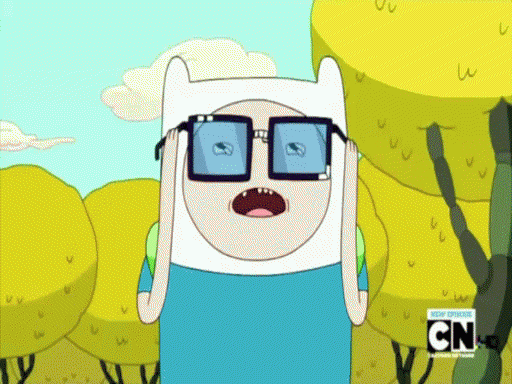

### 1 &nbsp; Intro

In this post I'll look at Ted Sider's argument that [compositional nihilism](https://en.wikipedia.org/wiki/Mereological_nihilism) is necessarily false.[POP]Sider, Theodore, van Inwagen and the Possibility of Gunk. Analysis 53, 1993: 285-9[/POP] The argument interests me for two reasons. The first is that compositional nihilism appeals to me, and at various points have subscribed to it (currently I have no opinion). The second is that I'm a big fan of Sider! I highly recommend his [Riddles of Existence](https://www.amazon.com/Riddles-Existence-Guided-Tour-Metaphysics/dp/0198724047/ref=sr_1_1?crid=2ZAQ8PK1XI1VC&dchild=1&keywords=riddles+of+existence+a+guided+tour+of+metaphysics&qid=1609346934&sprefix=riddles+of+ex%2Caps%2C181&sr=8-1) for a great casual philosophy / metaphysics read.

The argument relies on the concept of *gunk*, which believe it or not, is a technical philosophical term. Informally, gunk is stuff that divides infinitely, or at least, has no indivisible parts. According to Sider, the possibility of gunk rules out the metaphysical necessity of compositional nihilism. We might say that the cogs of the nihilist's worldview are all gunked up.

### 2 &nbsp; Preliminary Terminology

More formally, gunk is stuff that possesses no atoms. The term 'atom' here does not refer to the atom of physics. Rather it refers to the namesake of physics atom --- i.e., a thing with no parts. For this reason, the concept is often called a *mereological atom* to distinguish it. Below, I'll provide a formal definition of gunk and atoms, which first requires a definition of *parts* or part-hood.

2.1 &nbsp; Part-hood

We think of things as made of parts. A house has bricks as parts, a car has wheels as parts, etc.. In the study of [mereology](https://en.wikipedia.org/wiki/Mereology) the notion of 'part-hood' is made precise. Formally, where '[IMATH]P[/IMATH]' stands for 'is a part of':

[MATH]\begin{matrix} \forall_x \forall_y \left[\left(P_{xy} \, \& \, P_{yz} \right ) \rightarrow P_{xz} \right ] & \text{part-hood is transistive} & (2.1) \\ \\ \forall_x \forall_y \left[\left(P_{xy} \, \& \, P_{yx} \right ) \rightarrow x = y \right ] & \text{part-hood is antisymetric} & (2.2) \\ \\ \forall_x \left[ P_{xx} \right ] & \text{part-hood is reflexive} & (2.3) \end{matrix}[/MATH]

Careful note of 2.3 should be taken. It states that everything is a part of itself, and this is often contrary to the ordinary usage of the term 'part'. However, mereologists, perhaps taking a page from set theory, have found utility in defining 'part-hood' more broadly, such that a thing may be considered as a part of itself. Of course, in some contexts it will be useful to distinguish an object from its nonidentical parts. Thus, we introduce the notion of a 'proper-part', denoted as '[IMATH]PP[/IMATH]':

[MATH]\begin{matrix} \forall_x \forall_y \left[PP_{xy} \leftrightarrow \left( P_{xy} \; \& \; x \neq y \right ) \right ] & (2.4) \end{matrix}[/MATH]

That is, a proper part is a part that's not identical with the thing it is a part of.

2.2 &nbsp; Atoms & Gunk

Now we can define a mereological atom 'A':

[MATH]\begin{matrix} \forall_x \left[ A_x \leftrightarrow \lnot \exists_y \left[ PP_{yx} \right ] \right ] & (2.5) \end{matrix}[/MATH]

That is, something is a mereological atom if no thing is a proper part of it. It would be tempting to define an atom as something with no parts, but as 'part' is given special technical usage in mereology, every atom will have exactly one
part (i.e., itself).

So what is gunk? Simply put, an object is made up of gunk if it has no mereological atoms as parts. Formally:

[MATH]\begin{matrix} \forall_x \left[ G_x \rightarrow \lnot \exists_y \left[ A_y \; \& \; P_{yx} \right ] \right ] & (2.6) \end{matrix}[/MATH]

Another way of putting this is that something made of gunk divides forever into smaller and smaller parts, *never terminating in a set of atoms* --- gunk is infinitely divisible. However, infinite divisibility is not a sufficient condition for gunk. As Sider points out, many mathematical objects, such as lines and curves, are infinitely divisible and yet composed of atomic parts:

> "However, a line segment is infinitely divisible, and yet has atomic parts: the points. A hunk of gunk does not even have atomic parts 'at infinity'; all parts of such an object have proper parts."[POP]Sider, Theodore, van Inwagen and the Possibility of Gunk. Analysis 53, 1993: 285-9[/POP]

And, at least in some interpretations of calculus, we can add infinitesimals, or differential quantities to list of atoms found at division by infinity.

So, although infinite divisibility is a necessary condition of gunk, it is not a sufficient one. The essential characteristic of gunk, rather, is that it is atom-less. Glancing back at (2.6) this is clearly shown, as the definition's contraposition is:

[MATH]\begin{matrix} \exists_y \left[ A_y \rightarrow \forall_x \left [P_{yx} \rightarrow \lnot G_x \right ] \right ]  & (2.7) \end{matrix}[/MATH]

With the concept of gunk, we can go a step further and conceive of a  *gunky world*. A gunky world is a possible world that contains no mereological atoms. I.e., everything in a gunky world, including the totality of the world, is just a bunch of gunk.

> Aside: I have secured the rights to a new theme park, *GUNK WORLD&#8482;*.

2.3 &nbsp; Composition & Nihilism

If you're not into metaphysics (*do you even mind-body, bro?*) the phrase *compositional nihilism* probably seems a tad bizarre. So let me bring it down to Earth. I am typing on a keyboard, which is made up of keys, switches, circuits, etc.. The keyboard is *composed* of those parts. Furthermore, those parts are made out of physical materials. Those materials are composed of atoms, which in turn are composed of subatomic particles... you get the picture.

Now, the compositional nihilist will say something like this:
> "...*strictly speaking*, there are no such things, just as, strictly speaking, the sun does not rise in the morning. We find it useful to speak of the sun rising, and are not alarmed when we are reminded that this is strictly speaking false, for there is a true proposition we could assert, but don’t bother to. Rather than saying 'The sun is rising', I could say 'The earth is now rotating relative to the sun in such a way that there is coming to exist an unobstructed straight path between the sun and my present vantage point.' How unromantic! And how inconvenient as well—small wonder that we speak falsely without batting an eye.

> What are the complicated truths that we do not bother to assert, uttering instead falsehoods like 'there are some tables'? Complicated assertions about the smallest parts of the 'tables'. Rather than claim that there are many fundamental
particles here in my 'room' next to my 'chair', which particles behave so as to prevent my 'computer', 'keys', and 'briefcase' from falling to the 'floor', instead I say simply 'There’s a table in my room'."[POP]Sider, Theodore, van Inwagen and the Possibility of Gunk. Analysis 53, 1993: 285-9[/POP]

Let's make the idea a little more formal. Let's imagine a world that contains just two atoms, [IMATH]a_0[/IMATH] and [IMATH]a_1[/IMATH], stuck together in such a way that ordinarily we would say they compose an object. Now, if composition is possible, then the set of objects in this world is something like:

[MATH]\{ a_0, a_1, (a_0, a_1) \}[/MATH]

The two atoms *and* the object they compose. If compositional nihilism is true, however, then the set of objects in the world is just:

[MATH]\{ a_0, a_1 \}[/MATH]

Just to be clear, the compositional nihilist will still talk about tables and chairs, and they will agree that this chair is composed of parts from Ikea. But this is just an *informal* way of speaking. The correct / formal way to describe things is in terms of the arrangement of mereological atoms. And it is important that the two manners of speaking are not equivocated.

### 3 &nbsp; Sider's Argument

Sider asks us to imagine the possibility of gunk, and of gunky worlds. There's no apparent contradiction to these concepts, so they appear possible in the metaphysical sense. Now, if compositional nihilism is true, then the only things which truly exist are atoms. But a gunky world contains no atoms:

> "So [compositional nihilism] entails that at a gunk world, there are no material objects. This is quite implausible. Surely there is a gunk world in which some gunk is shaped into a giant sphere, and another where some gunk has the shape of a cube. Surely there are gunk worlds that most of us would describe as containing objects much like objects from our world: tables and chairs, mountains and molehills, etc."[POP]Sider, Theodore, van Inwagen and the Possibility of Gunk. Analysis 53, 1993: 285-9[/POP]

Let's give structure to this argument:

(3.1) &nbsp; A gunky world is not empty. [Prem]

(3.2) &nbsp; If compositional nihilism is true, there are only atoms. [By definition]

(3.3) &nbsp; A gunky world has no atoms. [By Definition]

(3.4) &nbsp; If compositional nihilism is true, a gunky world is empty. [from 2 & 3]

(3.5) &nbsp; Compositional nihilism is false. [from 1 & 4, modus tollens]

Premises (3.2) and (3.3) are just definitional. (3.4) and (3.5) are logically entailed by what's preceded. So the only premise available for objection is (3.1). Premise (3.1) emerges from the intuition that when we picture a gunky world, we can imagine stuff in in it, e.g., gunk shaped spheres and cubes. It should also be noted that premise (3.1) depends on gunk being metaphysically possible in the first place. So far, however, we've seen no reason to question this.

### 4 &nbsp; Response

4.1 &nbsp; Are Gunk Worlds Empty?

Should the compositional nihilist agree to (3.1), that *a gunky world is not empty*? Should she agree that there are "tables and chairs, mountains and molehills"? If speaking formally, why should the compositional nihilist agree to this when they didn't agree to it in a non-gunky world? If we are speaking formally, has the argument has not begged the question, implicitly assuming that composition is possible? It would be no surprise then that we can derive the conclusion that compositional nihilism is false. So, if we are to agree to (3.1), it can only be in the informal sense in which the compositional nihilist also agrees to the existence of table and chairs in an atomistic world.

But now look at that same phrase, "a gunky world is empty", in the antecedent of (3.4).[POP]If compositional nihilism is true, a gunky world is empty. [from 2 & 3][/POP] In which way are we talking here? When the compositional nihilist looks into a room full of chairs and says, "there are no chairs in here", she is speaking formally. She would make no such denial when speaking informally. Likewise, we should only agree to (3.4) if we are speaking formally.

So in (3.1) we agree to the phrase "a gunky world is empty" informally, and in the antecedent of (3.4) we agree to it formally. It should be clear now, that in using (3.1) to negate the antecedent of (3.4), we have equivocated. These two phrases, while superficially the same, meant two different things. The argument is not valid.

4.2 &nbsp; Is Gunky Composition Possible?

We have a sufficient rebuttal to Sider, I think. But this does make me wonder about the tenability of our intuitions of a gunky world of "tables and chairs, mountains and molehills". The compositional nihilist doesn't have to agree to (3.1), but this does *seem* to imply that such a world is empty, which admittedly seems a bit odd.

So here's a question. What should sider say exists, in the strict formal sense, in a gunky world? Atoms definitionally are out. But he believes "mountains and molehills" and the like exists. If we are to agree that the gunky world is not empty, in the strict sense, then *gunky composition must be possible.*

In an episode of the television show Adventure Time, titled "The Real You", Finn puts on the "Glasses of Nerdicon" which allows him to see the complete depths of the Universe. He perceives that his universe is just a microscopic part
of an exactly similar universe, and that down beneath the molecules, atoms, and quarks the world divides infinitely into more microscopic exactly similar universes. Let's call this kind of world a Nerdicon world.

Now, a Nerdicon-world would not be possible if Atomism were true, for division would stop at the mereological atoms. But in a world with no mereological atoms --- i.e., a gunky world --- a Nerdicon world *would be possible*! It would just
be one possible configuration of a gunk world.

Suppose that composition is possible is possible in a gunky world. A gunky Nerdicon world would have, then, among other things, universes as parts. But by identity of indiscernibles[POP][MATH]\forall F\, \forall_x\,\forall_y\,[(Fx\leftrightarrow Fy)\rightarrow x=y][/MATH][/POP] (defended [here](#/blog/the-identity-of-indiscernibles)) each of these universes is numerically identical. Thus, each universe has itself as a part.

Now, recall the definition of a proper part (2.4).[POP][MATH]\begin{matrix} \forall_x \forall_y \left[PP_{xy} \leftrightarrow \left( P_{xy} \; \& \; x \neq y \right ) \right ] & (2.4) \end{matrix}[/MATH][/POP] If [IMATH]x[/IMATH] is a proper part of [IMATH]y[/IMATH], then [IMATH]x[/IMATH] and [IMATH]y[/IMATH] cannot be identical. It follows from this that in a Nerdicon world there would be no proper parts, since each universe would have itself as a part.[POP]And for every part: remember that part-hood is transitive. So take, for example some tree in a universe in a Nerdicon World. It will divide into a universe that has it as a part, and similarly is part of a universe that is a part of the tree.[/POP]

Next, recall the definition of a mereological atom (2.5).[POP][MATH]\begin{matrix} \forall_x \left[ A_x \leftrightarrow \lnot \exists_y \left[ PP_{yx} \right ] \right ] & (2.5) \end{matrix}[/MATH][/POP] An object [IMATH]x[/IMATH] is an mereological atom iff there is no thing [IMATH]y[/IMATH] that is a proper part of it --- i.e., a mereological atom is a part with no proper-parts. But if there are no proper parts in a Nerdicon world, then by definition *each universe is a mereological atom*!

So, gunky composition fills a gunky world with atoms. But, of course, this is a contradiction. A gunky world is, definitionally, a world without atoms. So, reductio ad absurdum, we are forced to reject the assumption that gunky composition is possible.

You might argue that it is a Nerdicon world which is not possible, rather than gunky composition. But by itself a Nerdicon world did not lead to the contradiction. It was only when we assumed gunky composition was possible that we found an issue.

We started this section wondering about the apparent absurdity that, according to compositional nihilism, gunky worlds are empty. But we also saw that Sider needed gunky composition in order for us to agree that gunky worlds contained mountains, molehills, and the lik. But gunky composition lead to a contradiction. So, if anything, perhaps the apparent absurdity of empty gunk worlds has more to do with gunk than with compositional nihilism.

