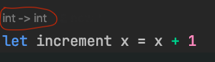
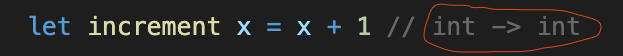

# Tips For Learning FP with F#

## Intro
There are plenty of great resources for learning FP and F#. I have no intention of throwing my hat in the ring. However, there were a few hurdles that I struggled with when I first learned FP, and I've seen my colleagues struggle with many of the same things. So, consider this post a supplement to more comprehensive FP learning resources. (If you're looking for such an resource, I highly recommend [F# for Fun and Profit](https://fsharpforfunandprofit.com/))

[comment]: <> (This post is intended to be a practical guide to the essential concepts of functional programming necessary to get up and running. In particular, it is directed at experienced developers from an objected-oriented or imperative background. However, it should also be useful to beginner programmers. I won't go into much theory or advanced concepts &#40;though those are cool and useful&#41;. My goal is simply to reduce the frustration that often comes from learning a new way of solving problems.)

[comment]: <> (I'll be using F# and C# for my examples, but the ideas should translate to other languages, with only syntactic or presentational differences. )

## Beginner's Mind
When I started learning FP, I really struggled. I'd been doing imperative and OO style for years, and I kept trying to apply the same ways of thinking to FP. It's human nature to hold on to the strategies that have worked for us in the past. It's like the old adage:

> When you're holding a hammer, everything looks like a nail. 
 
Once I was finally able to grasp FP, I was surprised at how simple it was. In fact, I think beginners would have an easier time learning a language like F# than C#. If you think back, you didn't always think in an OO or imperative way; you learned to think that way through learning that style of programming.

So, if you're expecting F# to be C#, then you're going to be constantly frustrated.[POP]I had a colleague who argued that it shouldn't be called F# because it didn't feel at all like C#. But the argument isn't cogent: by the same standard C# shouldn't have the 'C' as switching between the two languages is really jarring. There aren't even classes in C! Furthermore, I'd argue F# and C# have more in common than C and C#. Both are .Net languages, can use all the base libraries, and they are bidirectionally interoperable. So, the name seems pretty apt to me.[/POP] But you were probably frustrated when you first learned C#, because that style of thinking was new to you then. 

So, start with a beginner's mindset. Pretend you know nothing.


I think you'll find that once you start thinking functionally, *most* everyday programming problems become easier (and more fun) to solve.

## Everything Is a Value, 
TODO: Functions are values, functions always take in a value and always return a value. The `unit` type.
## Left Associativity
TODO

## Pay Attention to Types
F# is a statically typed language. However, most of the time you don't need need to specify types (explicitly). So you could write...
```fsharp
let increment (x: int): int = x + 1

increment 5    // int = 6
```
As...
```fsharp
let increment x = x + 1
```

And the compiler will figure out from context what types are in play.[POP]There are some circumstances where the type is ambiguous, and so you must specify it explicitly. E.g., if two record types `A` and `B` each have a field, `name: string`, and your function only invokes the `name` field, the compiler won't be able to determine whether the type is `A` or `B`.[/POP] Because of this, it is often easy to overlook type signatures, which reveal important information about the objects you're working with.

Now, even though types can be implicit, if your IDE supports F# then it often will show you the types you're working with. Note the signatures (circled in red) displayed by the following IDEs:

Rider:



VS Code: 



Because this blog post is written in markdown, going forward I will either denote types explicitly, or use the VS Code style of putting the type in a comment off to the side. 

### Use Types to Understand Function Signatures
Something that often causes confusion is how function signatures are denoted. It's easy enough to understand in the case of a one parameter function. For example, the `increment` function above has a type of `int -> int` which you can read as "this takes an `int` and gives you back an `int`".

Where people are often thrown off is when you have multi-parameter functions: 
```fsharp
let add x y = x + y   // int -> int -> int

add 3 5    // int = 8
```

The `add` function has a signature of `int -> int -> int`. This notation seems confusing, until you understand *why* it's written that way, and then it is quite intuitive. 

The first thing you have to understand is that *all* functions only have one parameter...

But wait! What about the `add` function above? Clearly it has two parameters!

Well, the way the `add` function is written above is just syntactic sugar. What the function *really* looks like under the hood is:
 
```fsharp
let add x =           // int -> int -> int
    fun y -> x + y
```

So, when you read `int -> int -> int` you should see it as `int -> (int -> int)`. That is, `add` is a one parameter function that takes an `int` and returns a function of `int -> int`. So, when you appear to be passing a second argument to `add`, you're really passing it to the funciton that `add` returns (remember, F# is left-associative).[POP]This is known as [currying](https://en.wikipedia.org/wiki/Currying). [/POP]

"But", I hear you say, "that's just arbitrary! Why limit yourself to single parameter functions?". Well, it's actually quite useful, as I'll show in the next section.

### Using Types to Understand Partial Application
Since passing the first parameter of a function returns a new function, you don't have to pass all of the arguments to a function. This allows you to build new functions out of old ones, essentially giving you the equivalent of polymorphism in OO. Check out the examples bellow:

A simple example:
```fsharp 
let add5 = add 5    // int -> int

add5 3    // int = 8
```

A more interesting example: 
```fsharp 
type Logger =
    {
        Log: string -> unit
    }
    
let consoleLogger = { Log = Console.Write }       // Logger
let mockLogger = { Log = fun _ -> () }            // Logger

let addAndLog logger x y =                        // Logger -> int -> int -> int
    logger.Log $"The sum is: %i{x + y}"
    x + y
    
let addAndConsoleLog = addAndLog consoleLogger    // int -> int -> int
let addAndMockLog = addAndLog mockLogger          // int -> int -> int
```

Compare this last example with polymorphism in an OO language. You would have to define an abstract base class, and then two additional classes that implement the base class. Generally, that involves (at least) three different files and a lot of boiler-plate. In F# we were able to achieve the same thing in just a few lines of code. 

Another useful feature of partial application is how it enables fluid APIs when combined with the pipe (`|>`) operator. The pipe operator is defined as...
```fsharp
 let (|>) f x = f x
 ```
...which enables you to pass in parameters from the right side of a function, like so:
```fsharp
3 |> add 5       // int = 8
```

Which admittedly looks pretty goofy on it's own. But, check it out in a more common context:
```fsharp 
[ 1; 2; 3; 4 ]
|> List.map add5                    // [ 6; 7; 8; 9 ]
|> List.filter (fun i -> i < 8)     // [ 8; 9 ]
|> List.sum                         // int = 17
```

This is very similar C#'s fluid API for collections, LINQ:
```csharp
var myList = new List<int> { 1, 2, 3, 4 };

return myList
    .Select(i => i + 5)
    .Where(i => i < 8)
    .Sum();
```

What's nice about pipes and partial application, is that they are completely generalizable, whereas LINQ only works with lists. For example, here's an F# function that goes between multiple types using pipes:
```fsharp
let toSnakeCase sentence =      // string -> string
    sentence 
    |> String.split " " 
    |> List.map toLower 
    |> String.concat "_"
```

In C#, you *can* create fluid APIs for types other than collections by writing extension methods for each type. But this is a lot of boilerplate, whereas with pipes and partial application, no extension methods are needed. It's just plug and play.

## File Order Matters
## Thinking in terms of pipelines
## Tuples are really useful 
When I worked in C#, I always thought the tuples were the silliest type, and rarely found a case where they better than a POCO. And I was justified in that belief; tuples are really awkward in C# (although, this has changed somewhat since the introduction of named tuples).
## Decomposition and Pattern Matching 