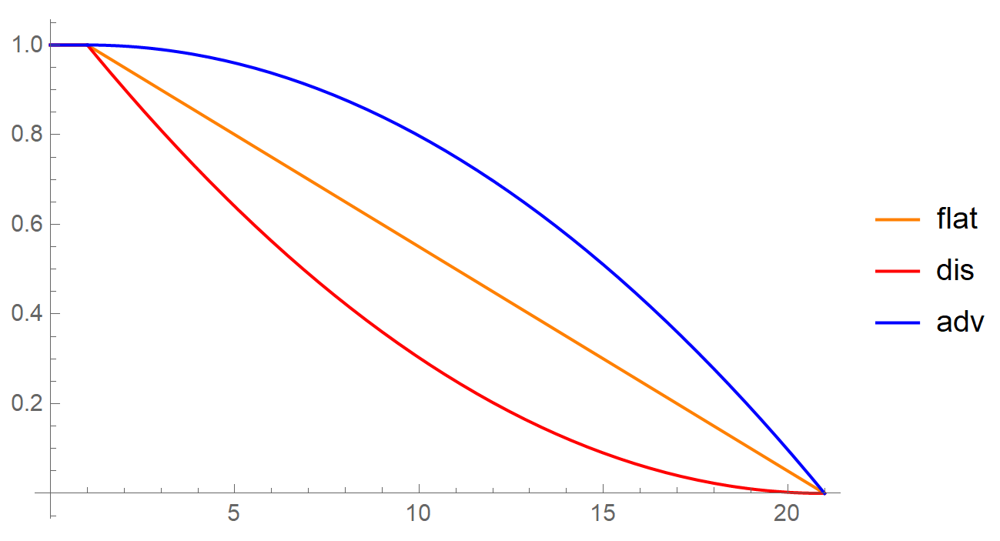
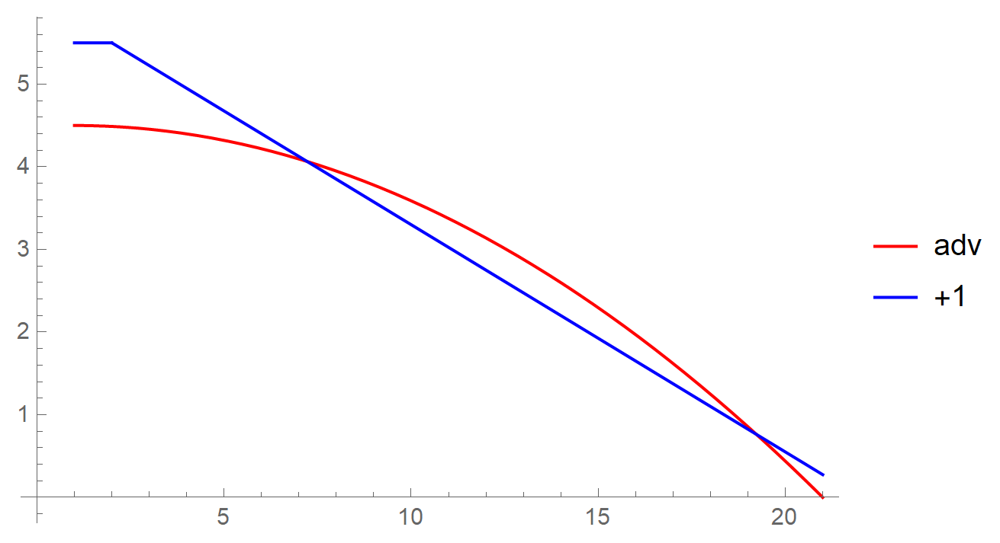
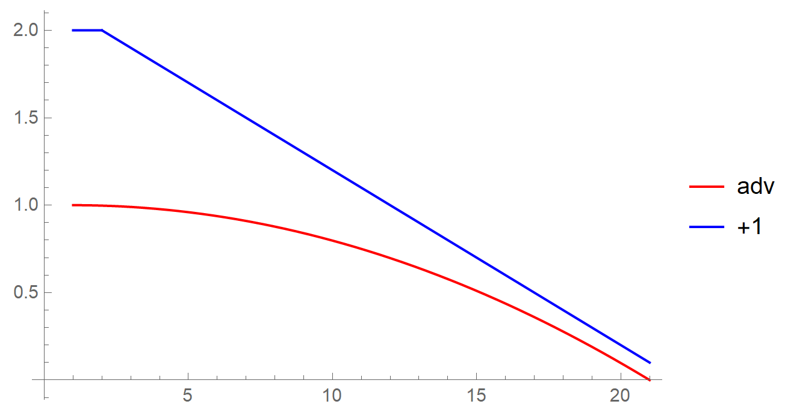
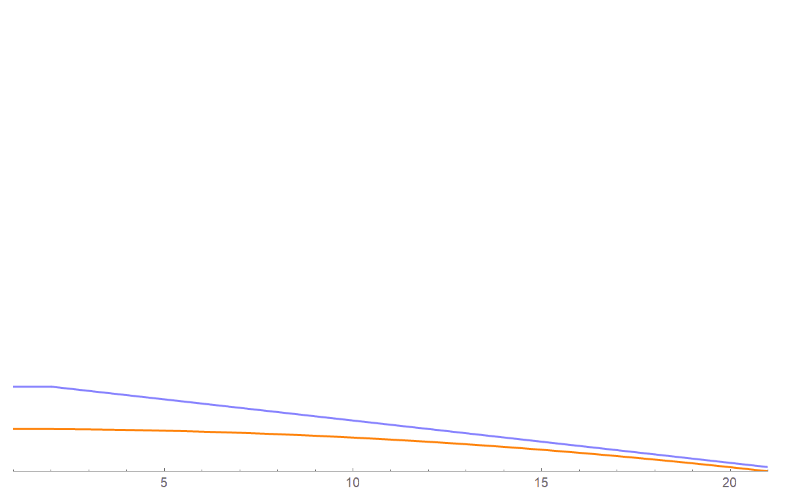

## Introduction
I love math. I love D&D. Lucky for me, the two go together like peanut butter and jelly.

> *Disclaimer:* Do all your math-ing before game-time. Don't bring a calculator to the table. That's meta-gaming, bro. Just get into character and have fun.

Want to know whether you should pick up a feat that lets you roll with advantage or increase your ability stats for a fatter modifier? Curious just how much that +1 weapon will help you? Do you have any chance of taking on this dragon? This post will give you the probability basics you need to answer these questions.

## The Basics

> Everything that follows is based on 5e. Also, it doesn't consider the optional rule where a natural 20 or 1 is an automatic success or failure, respectively.

### Flat Success

In the most basic scenario (no advantage, disadvantage, ect.) what are your odds of success?

Ability checks, saving throws, and attack rolls all have the same form:

[MATH]1\text{d}20+m \geq t[/MATH]

Where [IMATH]m[/IMATH] is the sum of modifiers and proficiencies a character has on the roll, and [IMATH]t[/IMATH] is the difficulty or armor class (DC or AC respectively) of the task or enemy --- we'll use [IMATH]t[/IMATH] to stand for *target* number.[POP]*'d' for difficulty* is a bad choice of variable, as you also have __d__ice, and the differential symbol --- eg., [IMATH]dx[/IMATH] --- to cause confusion.[/POP] All DCs and ACs are integer values on [1, 30].

Denote the result of a d20  roll as [IMATH]X[/IMATH], and denote set of possible successful rolls as [IMATH]S[/IMATH]. Success requires that [IMATH]X+m \geq t[/IMATH], so we can define [IMATH]S[/IMATH] extensionally:

[MATH]S = \{ X = 20 \; \cup \; X = 19 \; \cup \ldots \cup \; X = t - m \}[/MATH]

It follows that the number of possible success events is:

[MATH]\begin{align*} |S| &= 20 - (t-m) + 1 \\ &= 21 + m - t \end{align*}[/MATH]

There are twenty possible outcomes of the roll, so the cardinality of sample  space is:

[MATH]|X|=20.[/MATH]

From this we know that the probability that a d20 lands on a given value, [IMATH]x[/IMATH], is:

[MATH]\begin{align*} P(X=x) &= \frac{1}{|X|} \\ &= \frac{1}{20}  \end{align*}[/MATH]

Finally, we can derive an equation which answers the question, *what are my odds of success in any given basic roll?*

[MATH]\begin{align*} P(S) &= \sum \limits_{i=1}^{|S|} P(X = i) &\text{[members of $E$ are pairwise disjoint.]} \\ &= \sum \limits_{i=1}^{|S|} P(X = x) &\text{[members of $E$ are equiprobable.]}  \\ &= |S| P(X=x) & \\ &= (21 + m - t) \left( \frac{1}{20} \right) & \end{align*}[/MATH]

For ease of communication let's call this the *flat-success* function, [IMATH]s_f[/IMATH]:

> [MATH]s_f(t, m) \equiv P(S) = (21 + m - t) \left( \frac{1}{20} \right)[/MATH]

### Advantage & Disadvantage

#### Disadvantage
When rolling with advantage or disadvantage, there are two independent dice rolls [IMATH]X_1[/IMATH] and [IMATH]X_2[/IMATH]. To succeed at a disadvantaged roll *both* dice rolls must be above the AC / DC (minus any modifiers). That is, we need to know that probability of both [IMATH]S_1[/IMATH] *and* [IMATH]S_2[/IMATH] occuring:

[MATH]\begin{align*} P(S_d) &= P(S_1 \cap S_2) & \\ &= P(S_1) P(S_2) &\text{[$S_1$ and $S_2$ are independent.]} \\ &= P(S)^{2}&\text{[$S_1$ and $S_2$ are equiprobable.]} \\ &= s_f(t, m)^{2} & \end{align*} [/MATH]

Let's call this the *disadvantaged-success* function, [IMATH]s_d[/IMATH], and substitute in [IMATH]s_f[/IMATH]:

> [MATH]s_d(t,m) = (21 + m - t )^2 \left( \frac{1}{20} \right)^2 = \frac{1}{400} (21 + m - t)^2 [/MATH]

#### Advantage

To succeed at an advantaged roll, all that is required is that *either* [IMATH]X_1[/IMATH] *or* [IMATH]X_2[/IMATH] is greater the AC / DC (minus any modifiers):

[IMATH]\begin{align*} P(S_a) &= P \left(S_1 \cup S_2 \right) & \\ &= P\left( \overline{ \overline{S_1} \cap \overline{S_2}} \right) &\text{[De Morgan's Rule.]} \\ &= 1- P\left( \overline{S_1} \cap \overline{S_2} \right) & \\ &= 1-P( \overline{S_1} )P( \overline{S_2} )  & \\ &= 1- (1 - P(S_1) )(1 - P(S_2) ) & \\ &= 1- (1 - s_f(t, m) )^{2} & \end{align*}[/IMATH]

Let's call this the *advantaged-success* function, [IMATH]s_a[/IMATH], and substitute in [IMATH]s_f[/IMATH]:

> [MATH]s_a(t,m) = 1 - \left( \frac{1}{20}(t-m-21) + 1 \right)^2 = \frac{1}{400} (-t^2+2 d+399)[/MATH]

## Analysis

To get a feel for how advantage and disadvantage affect your outcome, let's assume [IMATH]m = 0[/IMATH] and plot the functions over [IMATH]t \in [1, 21][/IMATH]:

This matches what you would intuitively would expect. Rolling with advantage gets you better odds than a flat roll, and rolling with disadvantage puts you at... well, a disadvantage. Furthermore, the three functions converge at high at low DC/ACs where the success or failure are guaranteed.

### Ability Modifier Impact

When you increase your ability modifiers how much has your lot improved? Well, if we look at the *flat-success* function[POP][MATH]s_f(t, m) = (21 + m - t) \left( \frac{1}{20} \right)[/MATH][/POP] we see that it's a linear function, and so increasing or decreasing [IMATH]m[/IMATH] will just shift the plot of the function up and down. This also means that it's a straight-forward task to determine what percent difference is made by increasing [IMATH]m[/IMATH] --- we simply need to subtract a roll without a modifier from one with a modifier:

[MATH]\begin{align*} \Delta P(S) &= s_f(t, m) - s_f(t, 0) \\ &= \frac{21+m-t}{20}-\frac{21-t}{20} \\ &= \frac{21+m-t-21+t}{20} &= \frac{\cancel{21}-\cancel{t}+m-\cancel{21}+\cancel{t}}{20} \\ &= \frac{m}{20}\end{align*}[/MATH]

This means that for every +1 increase to our modifier, we get a [IMATH]\frac{1}{20}[/IMATH] or 5% improvement to our odds of success!

### Advantage vs Modifier

Are you better off taking a feat that lets you roll with advantage, or pumping up your ability scores to get that sweet +1 to your skill checks? Well, we know from above that for every +1 increase to our modifier the chance of success improves by 5%. This raises the question, how much of a percent increase do you gain by rolling with advantage? Looking at the graph of *advantaged-success* function[POP][MATH]s_a(t,m) = \frac{1}{400} (-t^2+2 d+399)[/MATH][/POP], the obvious answer is *"it depends"*. The function isn't linear, so how much of an increase we get is dependent on how difficult the task is.

But we can ask, *how much, __on average__, do our odds improve?* To answer this question we need to know the average values of our *flat-success*[POP][MATH]s_f(t, m) = (21 + m - t) \left( \frac{1}{20} \right)[/MATH][/POP] and *advantaged-success*[POP][MATH]s_a(t,m) = \frac{1}{400} (-t^2+2 d+399)[/MATH][/POP] functions. Again we'll assume [MATH]m=0[/MATH].

In the case of *flat-success*, since it's a line, the answer is simply 0.5 or 50%. But for our *advantaged-success* function we'll need to do some calculus. Sweet!

The equation for the average value of a function is:

[MATH]\bar f = \frac{1}{b-a}\int\limits_a^b {f\left( x \right) \, \text{d}x}[/MATH]

So we need to find:

[MATH]\bar s_a(t, 0) = \frac{1}{21-1}\int\limits_1^{21} {s_a(t, 0) \, \text{d}x}[/MATH]

I'll spare you the derivation --- and I'm embarrassed to admit that I had to dig up some old notes to freshen up my integration rules. But the average value of our *advantaged-success* function is [IMATH]\frac{2}{3}[/IMATH] or 66.6...%!

This means that rolling with advantage improves your odds by nearly a whopping 17%! In order to get a greater benefit from a modifier or bonus you would need at least a +4 increase, which is a lot!

*Advantage Wins!*

### Advantage vs +1 Weapon?
The case of a +1 weapon is slightly different as not only does your ability check get a +1 increase, but your damage roll *also* gets a +1 increase. So we need to rework the problem with the damage factored.

To answer this question, we need to find the [expected value](https://en.wikipedia.org/wiki/Expected_value) of a roll that uses a +1 weapon as well as one that doesn't. The general equation for expected value is:

[MATH]E[X]=\sum_{i=1}^{k} x_{i} \, p_{i}[/MATH]

Where [IMATH]x_i[/IMATH] represents the value of each possible outcome, and [IMATH]p_i[/IMATH] is the probability of that outcome. In our case, there are only two outcomes, success and failure, and in the case of failure the value of the outcome is zero. Let [IMATH]A[/IMATH] denote the outcome of an attack roll. For a regular attack roll the expected value, then, is:

[MATH]\begin{align*} E[A] &= g \, P(S) + 0 \cdot  P( \bar S) \\ &= g \, P(S) \end{align*}[/MATH]

For advantage, we simply replace [IMATH]P(S)[/IMATH] with our *advantaged-success* function (again assuming [IMATH]m=0[/IMATH]):

> [MATH]\begin{align*} E[A_a] &= g \, s_{a}(t, 0)  \end{align*}[/MATH]

For a +1 weapon, on the other hand, we replace [IMATH]P(S)[/IMATH] with our *flat-success* function, replace [IMATH]g[/IMATH] with [IMATH]g + 1[/IMATH], and set [IMATH]m = 1[/IMATH]:

> [MATH]\begin{align*} E[A_{+1}] &= (g + 1)  \; s_f(t, 1) \end{align*}[/MATH]

Unfortunately, the answer to our question will vary depending on the value of [IMATH]g[/IMATH]. For example, if we choose a rapier --- the favored weapon of my character [Niko Whitteridge](https://github.com/brharper-clgx/Niko/blob/master/backstory.md) --- which has an average damage of 4.5,[POP][MATH]g_r = \left( \frac{1}{8} \right ) \sum \limits_{i=1}^8 i[/MATH][/POP] our two expected value functions look like this:

But if instead Niko used his Blowgun, which does exactly 1 damage, the functions would look like this:

So instead we're going to have to look at these as 3d functions. The average of a two-variable function is:

[MATH]\bar f = \frac{1}{(b-a)(d-c)} \int_a^b \int_c^d f(x,y) \, dx \, dy[/MATH]

As for the range of [IMATH]g[/IMATH] to integrate over, the most damage from a weapon I could find in [D&D Beyond](https://www.dndbeyond.com/) was an Antimatter Rifle, with 6d8 damage, resulting in an average damage of 27.[POP][MATH] g_{am} = \left( \frac{6}{8} \right ) \sum \limits_{i=1}^8 i[/MATH][/POP]

> *If you find something that does more damage let me know, and I'll recalculate.*

So let's calculate the average expected value for an attack roll with advantage:

[MATH]\begin{align*} \bar E [A_a] &= \frac{1}{(27-1)(21-1)} \int_{1}^{27} \int_{1}^{21} g \, s_a (t, 0) \, dt \, dg \\ &= \frac{28}{3} \\ &\approx 9.3 \end{align*}[/MATH]

Now let's do the same for a +1 weapon:

[IMATH]\begin{align*} \bar E [A_{+1}] &= \frac{1}{(27-1)(21-1)} \int_{1}^{27} \int_{1}^{21} (g + 1) \, s_f (t, 1) \, dt \, dg \\ &\approx 10.1731 \end{align*}[/IMATH]

So *on average* the +1 weapon appears to be a *slightly* better choice than rolling with advantage. However, it is worth taking the particular weapon your character uses into consideration. Take a look at the animated graph below. The value of [IMATH]g[/IMATH] is being varied from low to high and back. At high values of [IMATH]g[/IMATH] the orange advantage curve appears to be the better option. But at lower values, the blue +1 weapon function sneaks ahead. So choose accordingly.
> *It's worth noting that 27 damage is *unusually high*. Most weapons will do significantly less damage.*

### Can You Defeat the Dragon?

No. Run for your life....

