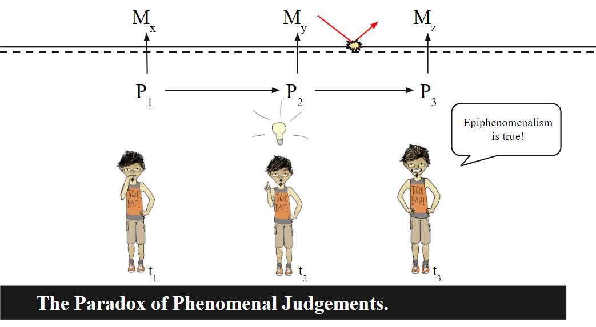
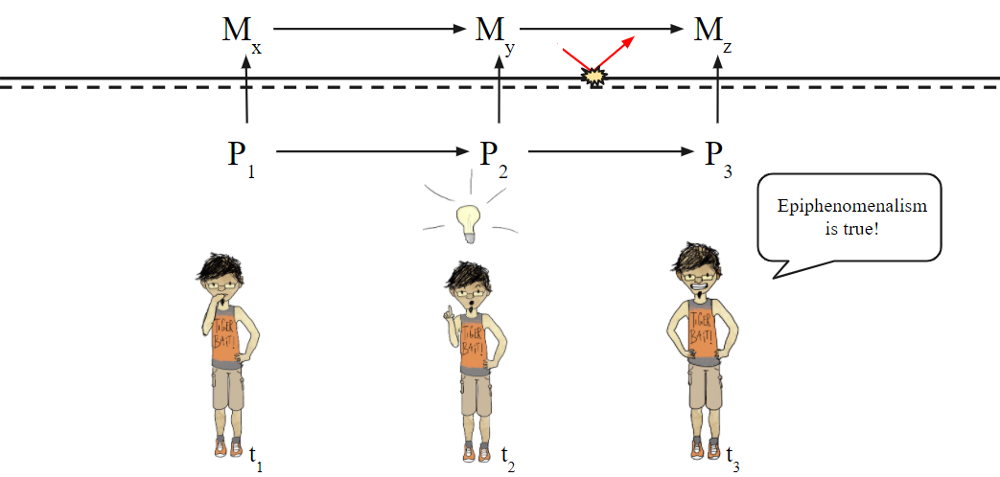

## Introduction

[Alvin Plantinga](https://en.wikipedia.org/wiki/Alvin_Plantinga) is a philosopher who has done some incredible work in epistemology and logic. I'm a big fan. Amusingly, though, I agree with few of his most prominent views. This is primarily because he is a theist and I am a [naturalist](https://tinyurl.com/cpwdvfn). So, naturally (no pun intended), when he devised an argument that claimed *naturalism was a self-defeating belief* it caught my attention. If Planinga's correct, well then my entire metaphysical world view will have collapsed! Which admittedly would change very little about my day to day life --- maybe I'd consider going to church or something --- but it would be a profound moment for my inner intellectual life.

I'll do my best to lay out Plantinga's argument --- called the *Evolutionary Argument Against Naturalism*, or *EAAN* for short. There are several versions of it ([1993](https://oxford.universitypressscholarship.com/view/10.1093/0195078640.001.0001/acprof-9780195078640), [1994](https://web.archive.org/web/20090930150703/http://www.calvin.edu/academic/philosophy/virtual_library/articles/plantinga_alvin/naturalism_defeated.pdf), [2002](https://www.amazon.com/Naturalism-Defeated-Plantingas-Evolutionary-Argument/dp/0801487633), [2008](https://www.docdroid.net/TLuwxbV/knowledge-of-god-alvin-plantinga-e-michael-tooley-pdf#page=5)), but I'll be working from the [latest](https://www.docdroid.net/TLuwxbV/knowledge-of-god-alvin-plantinga-e-michael-tooley-pdf#page=5) version as it seems to have dropped some of the more vulnerable aspects of earlier formulations. After, I've explained his argument, I'll offer my criticism and why I ultimately am not persuaded.

## The Evolutionary Argument Against Naturalism

The Argument in Full

According to the EAAN, belief in naturalism rationally leads to a sort of global skepticism that calls all of your beliefs into question, *including belief in naturalism itself*. The argument runs as follows:

#### Premise 1

> [MATH]N \rightarrow E[/MATH]

This states that *naturalism* ([IMATH]N[/IMATH]) is committed to *evolutionary theory* ([IMATH]E[/IMATH]). Plantinga argues that the naturalist needs evolutionary theory to explain the origin and diversity of life. Strictly speaking it's not logical entailment, but rather his claim is that evolutionary theory is a key part of the naturalist's worldview.

I'm willing to grant this premise, as most contemporary naturalists do hold evolution as a key part of their worldview. Of course, there were naturalists before Darwin, so *technically* you can be a naturalist who isn't committed to evolution. But this isn't something with which we'll worry ourselves.

There are two important implications to note about **Premise 1**. The first is that, with this commitment to evolution, under the naturalist worldview human minds are the product of natural selection. This means that our beliefs too are in some way an effect of evolutionary processes.

The second important point is that while we'll grant that naturalism is dependent on evolution, the converse is not true (Plantinga, e.g., believes in evolution while being a theist). This means that, if EAAN is correct, naturalism can be rejected without also rejecting evolutionary theory. The problem, Plantinga will argue, is specific to the conjunction of *naturalism and evolution*, not either by itself. In contrast, the conjunction of *theism and evolution* is not problematic, as  in this case, we can imagine that an omni-property God either guides evolution or properly sets up the initial conditions of the universe to Her liking. In contrast, naturalistic evolution is blind and arbitrary.

#### Premise 2

> [MATH]P \left( R | N \& E \right ) \text{is low.}[/MATH]

Which reads, the probability that *our beliefs are reliable* ([IMATH]R[/IMATH]) given *naturalism and evolution* ([IMATH]N \&E[/IMATH]) is low.

Plantinga frames this premise in terms of probability. While I love probability, I don't think it really has a place here, as it's unclear how to assign values to the relevant terms. What, for example, is the sample space we're working in?

So instead of a probabilistic framing, I'll interpret this as *we have better reason to believe* [IMATH]R | N \& E[/IMATH] is false than true. I see no reason that this should affect the argument or my criticism of it. Perhaps in another post I'll look more closely at the probability aspect.

#### Premise 3

> **Premise 2** defeats [IMATH]R[/IMATH].

If we have better reason to believe [IMATH]R | N \& E[/IMATH] is false than true, and we believe [IMATH]N \& E[/IMATH], then we must reject [IMATH]R[/IMATH].

#### Premise 4

> **Premise 3** defeats [IMATH]N \& E[/IMATH].

If our beliefs are unreliable, then we can't reasonably believe any of them, including our beliefs in *naturalism* and *evolution*.

#### Premise 5

> **Premise 1** and **Premise 4** defeats [IMATH]R[/IMATH] by itself.

As mentioned, *naturalism* depends on *evolution*, not the other way around.

#### Conclusion
> Metaphysical Naturalism is self-defeating

The argument appears structurally sound. In fact, premises **3**, **4**, and **5** all follow pretty straight-forwardly from **1** and **2**. It should be obvious that **Premise 2**[POP][MATH]P \left( R | N \& E \right ) \text{is low.}[/MATH][/POP] is the heart of the argument, so I'll spend the remainder of this post analyzing it.

Premise 2 in Depth

#### Naturalistic Beliefs

To understand why Plantinga thinks [IMATH]P \left( R | N \& E \right )[/IMATH] is low, we need to look at what beliefs *are* under a naturalistic world view. The naturalist doesn't believe in souls or an immaterial mind. Rather mind-stuff (beliefs, desires, etc.) is just physical-stuff. More precisely, a belief is some kind of neurophysiological process, event, structure, or all of the above.

Now, there are two aspects to a belief under this view. There are the neurophysiological properties of the belief --- Plantinga dubs these *NP* properties --- and then there is the *content* of the belief. So let's consider my belief that Cairo is the capital of Egypt. The *content* of this belief is the proposition *Cairo is the capital of Egypt*. The neurophysiological properties of the belief are some set of neurons, connected in a particular way, and firing in a particular manner, etc..

This distinction is *not* intended to imply that *belief contents* are somehow non-physical or disjoint from neurophysiological properties. It is simply to point out that we can meaningfully talk and think about about these two aspects of a belief.

It is also important to note that when it comes to the truth or falsity of our beliefs, we are talking about the truth or falsity of *belief contents*, e.g., the proposition that *Cairo is the capital of Egypt*. So in investigating whether our beliefs are reliable, it is specifically the *content* aspect of beliefs that is relevant.

> It is in virtue of having a content, of course, that a belief is true or false: it is true if the proposition which is its content is true, and false otherwise. My belief that all men are mortal is true because the proposition which constitutes its content is true, but Hitler’s belief that the Third Reich would last a thousand years was false, because the proposition that constitutes its content is (was) false.
> *-Plantinga (pg. 34 of [KoG](https://www.docdroid.net/TLuwxbV/knowledge-of-god-alvin-plantinga-e-michael-tooley-pdf#page=43))*

Now how are the *NP* properties and *contents* of a belief related? Plantinga says there are two candidates for this relation, reduction and [supervenience](https://en.wikipedia.org/wiki/Supervenience#:~:text=In%20philosophy%2C%20supervenience%20refers%20to,in%20X%20to%20be%20possible.). Under the reduction model, the content of a belief is just a combination of *NP* properties:
> We  could  put  this  by  saying  that  any  content  property  is  a  Boolean combination  of  NP  properties,  that  is,  a  combination  constructed  from  NP properties by disjunction, conjunction, and negation. And to say that content properties are reducible to NP properties is just to say that every content property is some Boolean combination of NP properties. In fact, if we think that any Boolean combination of NP properties is itself an NP property, we could say that content properties just are NP properties—a special sort of NP property, to be sure, but still NP properties. So, on this theory, content properties — e.g., the property of having *Naturalism is all the rage these days* as content—are, or are reducible to, NP properties.
> *-Plantinga (pg. 35 of [KoG](https://www.docdroid.net/TLuwxbV/knowledge-of-god-alvin-plantinga-e-michael-tooley-pdf#page=43))*

The alternative relation between *NP* and *content* properties is supervenience, the formal definition of which is somewhat abstruse, but it's easy enough to grasp intuitively. Wikipedia gives us a formal definition:
> X is said to supervene on Y if and only if some difference in Y is necessary for any difference in X to be possible.

Intuitively, we could say that the beauty of Van Gogh's *Starry Night* supervenes on the arrangment of paint on the canvas. For the painting to be ugly would have required a different arrangement of paint.

Supervenience and reduction are not mutually exclusive. Rather, supervenience should be thought of as a more general relation. To the best of my understanding, at least, reduction implies supervenience but supervenience does not imply reduction.

#### Beliefs and Natural Selection

Now, when it comes to natural selection, what role, if any, do beliefs play? Well, assuming our beliefs affect our behavior, then beliefs certainly have a significant impact on natural selection. An organism which enthusiasticlly runs into the mouth of a tiger is far less likely to survive and reproduce than one that doesn't. So if our ancestors had beliefs which lead them to run into tiger mouths, well things would look very different, wouldn't they? *An organism's beliefs need to be such that they behave in an evolutionarily adaptive way.*

Under naturalism, an organism's behavior can be completely described in terms of physical facts. Photons hit the retina, which triggers the optical nerves to fire, which leads to a bunch of complicated brain stuff, which eventually leads to the organism running from th tiger. The story of the organism's behavior is [physically causally closed](https://en.wikipedia.org/wiki/Causal_closure).

It follows that whatever role beliefs have in this complete causal description, it is the *neurophysiological properties* of  beliefs that play a role. Were an advanced alien anthropologist to study an  ancient hominid running from a saber-toothed tiger, she would not need to know the *content* of the beliefs of the hominid held in order to have a complete causal picture of the event. She would only need to know the *neurophysiological* description.

Evolution by natural selection, too, has physical causal closure. So the relevant role of beliefs in natural selection can be described merely in terms of *neurophysiological properties*. What the actual *belief contents* corresponding to those  neurophysiological properties are, seemingly, have no part to play. Returning to the example of a tiger:
> Even so, the content generated by this structure [NP properties], on this occasion, need have nothing to do with that predator, or with anything else in the environment. Indication is one thing; belief content is something else altogether, and we know of no reason why the one should be related to the other. Content simply arises upon the appearance of neural structures of sufficient complexity; there is no reason why that content need be related to what the structures indicate, if anything. The proposition constituting that content need not be so much as about that predator.
> *-Plantinga (pg. 38 of [KoG](https://www.docdroid.net/TLuwxbV/knowledge-of-god-alvin-plantinga-e-michael-tooley-pdf#page=43))*

So, according to Plantinga, evolution has selected certain beliefs, but only for those *NP* properties as they affect behavior. The actual *content* of those beliefs, plays no role, and so *could be anything*! It could be my belief that Cairo is the capital of Egypt which causes me to run from the tiger, or worse, that Cairo is *not* the capital of egypt, or any number of false beliefs. So, we have no reason to think that evolution selected for true beliefs, and thereby *no reason to consider our beliefs to be reliable*. This is Plantinga's defense of **Premise 2**[POP][MATH]P \left( R | N \& E \right ) \text{is low.}[/MATH][/POP].

## Response

Do Beliefs Inherit Their Merit from Natural Selection?

Plantinga argues that the content of individual beliefs cannot be selected for by evolution, and thereby our belief producing faculties have no cause to be reliable. But is this model --- where beliefs or belief producing mechanisms are evolved features --- even a view held by naturalists? The answer is no, at least not if you've given it a little thought.

Did our beliefs evolve? What about my belief that *[of Montreal](https://www.youtube.com/watch?v=HBfgQvM7wtE)* is one of the greatest bands to ever exist? Given that they only formed in 1996, I think it's safe to say this is not an evolved belief. What about Beth Harmon's belief that *The Queen's Gambit* is the best opening move for her game against Borgov? Again obviously not.

What about our belief producing faculties, did they evolve? A musician, through rigorous training, develops a faculty for correctly identifying notes (i.e., perfect pitch). She hears a sound and forms the belief *this is F#*. But this is something that is learned, not evolved. Through rigorous study logicians and mathematicians develop a faculty for derivation, but again, this is something learned.

Plausibly, when plantinga talks about belief forming faculties, he has in mind something more general or basic than the examples above. But it's unclear what a concrete case would be that is both (a) an evolved attribute, and (b) propositional. The ability to detect objects through vision, for example, while plausibly evolved, is not inherently propositional. And in fact, even low level abilities like these might be less innate than one would initially think; [see research on Molyneux's problem](https://www.nytimes.com/2011/04/26/health/research/26blind.html).

What we certainly *can* say has evolved is a large, flexible apparatus that can learn to do all kinds of things, i.e., a brain. But just as my hands didn't evolve to form the sign of the horns at an *of Montreal* concert, it's a mistake to say our brains evolved to have certain beliefs or belief forming faculties. Not all attributes of an organism have to have been selected for by evolution. So, the claim that the merit of our beliefs is dependent on the existence of an evolutionary process which selected for true belief is equivalent to saying my ability to form the sign of the horns with my hands is dependent on an evolutionary process which selected for it.

This leaves open how in fact our beliefs *are* justified. But the burden of proof is not on the naturalist to come up with an explanation. By making his argument, Plantinga shifted the burden of proof to the naturalist, but with his argument rebutted, we're back to square one. And the question of knowledge / justification is one contemplated by philosophers since, well, the beginning of philosophy. So, again, the burden of proof is not on the naturalist.

Is Content Unrelated to Adaptive Behavior?

I think the above is a sufficient response to Plantinga's EAAN. However, I am interested in looking more closely at belief content and its role in causation. So let's assume, for the sake of argument, that beliefs and belief forming faculties are selected for in the way Plantinga describes.

For Plantinga's argument to work, it must be the case that either (a) belief contents have *no causal properties*, or (b) the causal properties of belief contents have *no impact on natural selection*. The first disjunct is a view known as [epiphenomenalism](https://en.wikipedia.org/wiki/Epiphenomenalism), and in earlier formulations of EAAN Plantinga seemed to think that it was the dominant view among naturalists (see [2002](https://www.amazon.com/Naturalism-Defeated-Plantingas-Evolutionary-Argument/dp/0801487633) for example). But he seems to have ditched this in the most recent formulation.

Let's first consider the other option --- that belief contents *have causal properties*, but these causal properties have *no impact on natural selection* --- and then return to epiphenomenalism after.

#### Irrelevant Effects

So, let's suppose that the contents of beliefs have causal properties. For Plantinga's argument to work, it must be the case that these causal properties have no impact on natural selection. We've already agreed that *NP* facts impact natural selection insofar as they have *behavioral effects*. It follows that, *if belief contents have no selective impact, it's causal properties must be disjoint from those with behavioral effects.* There can be no overlap. If there was overlap, then they would have a role in natural selection.

Let's express things more formally...

Let our sample space, [IMATH]U[/IMATH], be the set of the causal facts involved in a complete causal description of an organisms behavior (the kind the alien anthropologist would have).

Let [IMATH]N[/IMATH] be the set of *NP* effects in [IMATH]U[/IMATH].

Let [IMATH]C[/IMATH] be the set of *belief content* effects in [IMATH]U[/IMATH].

Finally, let [IMATH]E[/IMATH] be the set of effects in [IMATH]U[/IMATH] not directly caused by beliefs (whatever's left over, essentially).

As we've defined [IMATH]E[/IMATH], it is disjoint from both [IMATH]N[/IMATH] and [IMATH]C[/IMATH]:

[MATH](1) \; N \cap E \equiv \emptyset \; \& \; C \cap E \equiv \emptyset[/MATH]

We've already stipulated that [IMATH]N[/IMATH] impacts natural selection, and so [IMATH]C[/IMATH] cannot have any overlap without also have the potential to impact natural selection:

[MATH](2) \; N \cap C \equiv \emptyset[/MATH]

From (1) and (2) it follows that:

[MATH](3) \; (N \cup E) \cap C \equiv \emptyset[/MATH]

But there's a problem here. In Plantinga's argument for **Premise 2**[POP][MATH]P \left( R | N \& E \right ) \text{is low.}[/MATH][/POP] he concluded that there was a complete causal description with only [IMATH]N \cup E[/IMATH] --- the alien anthropologist did not need *belief contents*. But this means that our complete causal picture [IMATH]U[/IMATH] is just the union of these facts:

[MATH]U \equiv (N \cup E)[/MATH]

However, as stated in (3), [IMATH]C[/IMATH] is disjoint from these sets. And the only set disjoint with sample space is the empty set. In other words, [IMATH]C[/IMATH] must be empty.

[MATH]C \equiv \emptyset[/MATH]

So, belief contents have no effects. They are causally inefficacious. But that's just epiphenomenalism, which we are supposing is false. Where have we gone wrong?

The mistake was to suppose that the causal properties of belief contents and *NP* facts were distinct. This assumption might *appear* plausible in the abstract, but that appearance falls apart with any concrete case. Let's return to the example of  Van Gogh's Starry Night. Beauty either supervenes on or is reducible to the physical properties of the paining. Now, I can say that the beauty of a painting moved me to tears. Alternatively, I can say that the arrangement of pigments on a canvas caused my tear ducts to open. These aren't two disjoint sets of facts; they are two ways of describing the same thing.

Let's call the description where beauty moves me to tears *the high-level view* and the description where pigments open my tear ducts *the low-level view*. Is it conceivable that these views are two disjoint sets of facts rather than just two ways of describing the same thing? Say we leave the low-level view exactly as it is --- can we then change the high-level view into another high-level view disjoint from the first, without the low-level view changing? Can we conceive of the corresponding high-level view as *doing somersaults while playing tambourine, but definitively not crying*, while maintaining the original low-level view? No. The new high-level view would require a different low-level view, precisely because these are both views of the same phenomena.

Returning to beliefs, the causal properties of *contents* are either the same as, or a subset of, the causal properties of the *NP* facts. They are the same thing seen from two different perspectives. This becomes obvious when looking at any concrete examples. Furthermore, supposing otherwise either leads to epiphenomenalism. So, *if belief contents have causal properties, we cannot say that they have no role in natural selection*.

#### Epiphenomenalism

Alternative (b) mentioned above is the view that mind-stuff (belief content in our case) has no causal properties. This is a view known as [epiphenomenalism](https://en.wikipedia.org/wiki/Epiphenomenalism). If true, then Plantinga's argument certainly looks stronger than before. So, is there good reason to adopt this view?

Well there's at least one very good reason *not* to believe it, a problem called *the Paradox of Phenomenal Judgements* (see pg. 180-181 of [The Conscious Mind](https://en.wikipedia.org/wiki/The_Conscious_Mind)). With the help of my (very patient) [girlfriend](https://www.instagram.com/hunterrosejshop/) I've created a diagram to illustrate the paradox:

In the diagram, [IMATH]P_1[/IMATH], [IMATH]P_2[/IMATH], and [IMATH]P_3[/IMATH] are *NP* facts in a causal chain. [IMATH]M_x[/IMATH], [IMATH]M_y[/IMATH], and [IMATH]M_z[/IMATH] are the mental facts corresponding to [IMATH]P_1[/IMATH] and [IMATH]P_2[/IMATH] respectively. But, as indicated by the red arrow, according to epiphenomenalism, mental facts don't have any effects --- causation is a one-way street, so to speak. Physical facts can bring about mental ones, but it's a dead-end from there (so many street analogies).

What's paradoxical here is that [IMATH]P_3[/IMATH] is the physical fact whereby our goateed philosopher declares that "Epiphenomenalism is true!" and [IMATH]M_z[/IMATH] is the corresponding judgement. Here he's made a judgement about mental facts without any mental facts belonging to the causal chain leading to the the production of the judgment. The declaration that "Epiphenomenalism is true!" is just a happy coincidence having nothing to do with any epiphenomenal mental stuff.

So, if our the goateed philosopher believes epiphenomenalism, and thinks things through, there will be another pair of facts [IMATH]P_k[/IMATH] and [IMATH]M_k[/IMATH], say, where he realizes that no epiphenomenal mental stuff could ever play a role in the formation of his beliefs. This in turn would logically lead him to conclude that none of his beliefs about mental stuff, including epiphenomenalism itself, have anything to do with mental stuff, thus undermining those beliefs. His belief in epiphenomenalism would undermine itself.

One possible solution to the paradox, is to allow mental-to-mental causation. This is a weaker sense of ‘epiphenomenal’. It is epiphenomenalism relative to some subset of entities, physical things, in this case.

Under this model, [IMATH]M_z[/IMATH] has a connection to the other mental facts, [IMATH]M_x[/IMATH] and [IMATH]M_y[/IMATH], and so there is the opportunity for [IMATH]M_z[/IMATH] to be a warranted belief about epiphenomenal mental stuff.

But there's a problem with this model too. According to Plantinga, the *content* of a given belief *could be literally anything* with no logical connection to corresponding the physical facts. I might be thinking 'Cairo is the capital of Egypt' while declaring 'Epiphenomenalism is true'. So, if a person behaves as though they believe in epiphenomenalism, that says nothing about the actual contents of there beliefs. But perhaps that isn't much of a problem. The belief contents themselves, at least, could be justified.

However, since theres no logical connection between any pair of mental and physical facts, [IMATH]P_i[/IMATH] and [IMATH]M_i[/IMATH], there is an issue of the mental causation being incoherent. Say [IMATH]M_x[/IMATH] is a belief content about penguins, [IMATH]M_y[/IMATH] is about the statistical significance of the Pfizer vaccine, and [IMATH]M_z[/IMATH] is the belief that 'Epiphenomenalism is true'. This is possible as the paring of [IMATH]P_i[/IMATH] and [IMATH]M_i[/IMATH] is arbitrary. In such a scenario, the causal chain of mental facts is incoherent, and cannot be said to justify [IMATH]M_z[/IMATH].

One last possible solution is proposed by [Chalmers](https://en.wikipedia.org/wiki/David_Chalmers):
>All this is to say that there is something intrinsically epistemic about experience. To have an experience is
automatically to stand in some sort of intimate epistemic relation to the experience—a relation that we
might call ”acquaintance.” There is not even a conceptual possibility that a subject could have a red
experience like this one without having any epistemic contact with it: to have the experience is to be related
to it in this way. -Chalmers (pgs. 196-7 of [The Conscious Mind](https://en.wikipedia.org/wiki/The_Conscious_Mind))

But if mental stuff is inherently epistemic in this way, Plantinga does not get the of global skepticism he needs for his argument.

## Conclusion

Plantinga's EAAN is an interesting argument, with some initial plausibility. It's structurally sound, and it's conclusion, if true, would be devastating to the naturalist. The key premise of EAAN is **Premise 2**[POP][MATH]P \left( R | N \& E \right ) \text{is low.}[/MATH][/POP]. Planinga's defense of this premise is that the truth-value of beliefs are properties of the *content* of a belief, whereas natural selection is only concerned with the neurophysiological properties of beliefs. So, Plantinga contends, the naturalist has no reason to believe evolution selected for reliable beliefs.

The primary issue with this argument is that Plantinga characterizes beliefs and/or belief forming faculties as evolved attributes of humans under naturalism. But this is a mischaracterization. My belief that *[of Montreal](https://www.youtube.com/watch?v=HBfgQvM7wtE)* is one of the greatest bands to ever exist, and my ability to identify their songs upon hearing them, are *not* evolved attributes. Furthermore, we also learned that even incredibly low level faculties, such as the ability to identify shapes visually, might be learned rather than innate (and thereby *evolved*) abilities. Furthermore, it's not clear that these low level faculties are propositional to begin with. So the naturalist was never committed to reliable beliefs being an evolved attribute.

We also explored the relation between *belief contents*, *NP* properties, and natural selection. There were a couple of  possible relations. One was that belief contents have causal properties which don't influence natural selection. This path reduced to epiphenomenalism unless we rejected the assumption that the causal properties of belief contents were different from the causal properties of neurophysiological facts. But Plantinga needed that assumption for his argument to  work. The alternative path, epiphenomenalism, at worst was itself self-defeating, and at best granted some inherent epistemic qualities beliefs, excluding global skepticism.

So, at least as far as EAAN is concerned, naturalism lives to see another day.
