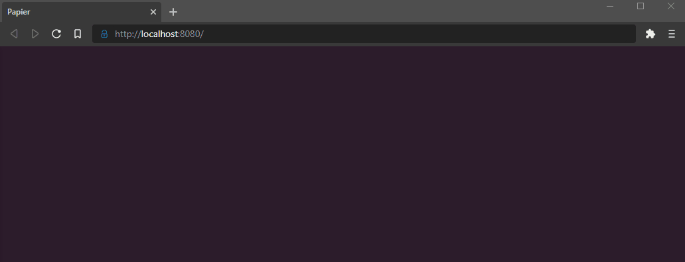
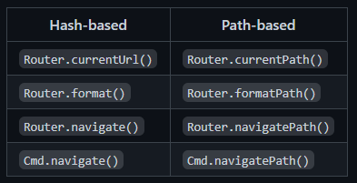
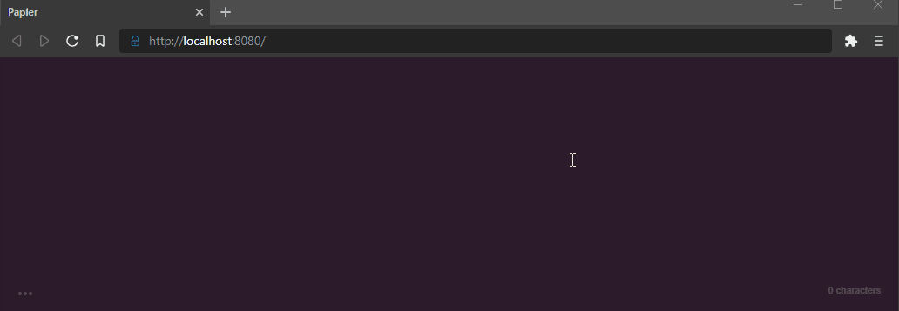
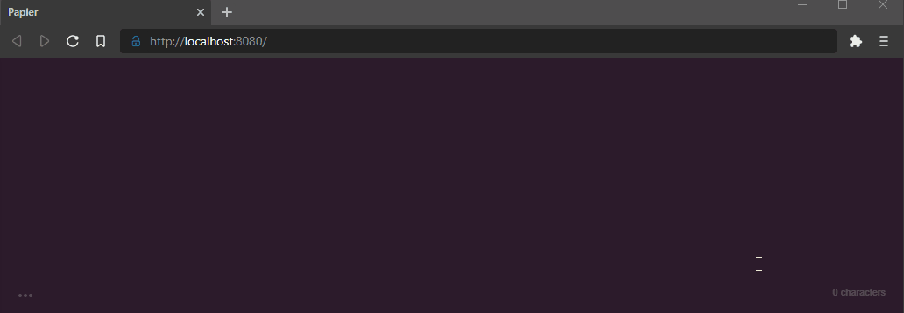
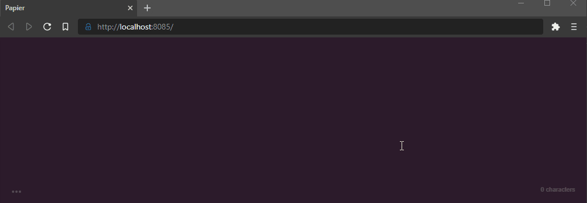

[feliz-router]: https://github.com/Zaid-Ajaj/Feliz.Router "Feliz Router"
[elm-nav]: https://elmish.github.io/browser/navigation.html "Elm Navigation"
[source]: https://github.com/bryanbharper/safe-stack-path-routing "Source Code"
[safe]: https://safe-stack.github.io/ "Safe Stack"

### Intro

This post will go over how to implement *path* routing in a [SAFE stack][safe] application. More specifically, this explainer will apply to any app that uses an [Elmish](https://elmish.github.io/elmish/) front-end, and a backend API built using a [Giraffe](https://github.com/giraffe-fsharp/Giraffe) derivative such as [Saturn](https://saturnframework.org/tutorials/how-to-start.html) or [Fable Remoting](https://zaid-ajaj.github.io/Fable.Remoting/). Decent documentation on routing already exists ([here][elm-nav] and [here][feliz-router]). However, those articles assume a purely front-end perspective, and don't cover complications that emerge between the back-end API and the front-end router. This post will fill in those gaps.

> *If you already have routing implemented but are struggling to get *path* routing to work with your back-end, skip ahead to section __"Configuring the Server"__ below.*

### The problem
Below is a basic web app built with the [SAFE stack][safe]. The source for this example can be found [here][source]. I recommend cloning the repo and following along. *Be sure to follow the steps in the [README.md](https://github.com/bryanbharper/safe-stack-path-routing/blob/feliz-hash/README.md) to get the app up and running.*



Note a few short-comings of this app:
- The URL does not change when navigating between pages --- this means it's not possible to directly navigate to a given page. So, for example, it wouldn't be possible to share a specific blog post. A user would have to navigate to it from the home page.
- The browser's *Back* button does not work. This makes the site less intuitive to navigate.

So, let's improve the app better by introducing routing.

### Hash Routing

> *The finished code for the following section can be found on the [feliz-hash](https://github.com/bryanbharper/safe-stack-path-routing/tree/feliz-hash) branch of the [repo][source].*

On a first pass we'll implement our solution using the [Feliz.Router][feliz-router] module. By default, `Feliz.Router` uses *hash* routes (e.g., `www.my-site.com/#/about`). Let's start with this default configuration and see where it gets us.

First we'll install the package:
```sh
dotnet paket add Feliz.Router -p Client
```

Now, `Feliz.Router` represents a URL path as a `string list`, so let's create a helper method that helps convert this list to our domain's `Url` type.

In `Urls.fs`:
```fsharp
let parseFeliz (url: string list) =
    match url with
    | [] -> Url.Blog // default page
    | [ _: string; slug: string ] -> Url.BlogEntry slug
    | [ page: string ] ->
        match Url.fromString page with
        | Some url -> url
        | None -> Url.NotFound
    | _ -> Url.NotFound
```

Next we'll modify the `render` function in `Index.fs` to use `Feliz.Router`:

```fsharp
open Feliz.Router

let render (state: State) (dispatch: Msg -> unit) =
    React.router [
        router.onUrlChanged (Urls.parseFeliz >> UrlChanged >> dispatch)

        router.children [
            Navbar.render Msg.UrlChanged dispatch
            getActivePage dispatch state.CurrentPage
        ]
    ]

```

Lastly, we'll need to change our navbar and blog entry links to use routes instead of dispatching the `UrlChanged` message. `Feliz.Router` gives us the option of programmatic navigation with the `Router.navigate` method, but for simplicity we'll just replace `prop.onClick` with `prop.href`. So, in `Index.fs` change the navbar links as follows:
```fsharp
Bulma.navbarItem.a [
    prop.text Url.About.asString

    Url.About.asString |> Router.format |> prop.href
]
Bulma.navbarItem.a [
    prop.text Url.Blog.asString

    Url.Blog.asString |> Router.format |> prop.href
]
Bulma.navbarItem.a [
    prop.text Url.Todo.asString

    Url.Todo.asString |> Router.format |> prop.href
]
```

Note that we pass the stringified Url to `Router.format` before passing it to `prop.href`. This ensures that what we pass a hash based route to `href`. For example, it would transform "about" into "#/about".

In `Pages/Blog.fs` modify `renderEntry` to the same end:
```fsharp
let renderEntry entry: ReactElement =
    Html.a [
        [ Url.Blog.asString; entry.Slug ]
        |> Router.format
        |> prop.href

        entry.Title |> prop.text
    ]
```

In this case `Router.format` takes a list of the URL segments. This will produce something like "#/blog/my-slug".

We're ready to test it out. Run the following command:

```sh
dotnet fake build -t run
```

Now open [localhost:8080](http://localhost:8080/) in a browser. You should see something like the following:


This is great. It has many advantages over the previous application.
- Each page has its own URL that can be shared or visited directly.
- We can use the browser's *Back* button to retrace our steps.

However, not all is well in the world. The `#` prefixing all of our Urls is more troublesome than it might seem. Many external tools such as Google's search or [Disqus](https://disqus.com/) won't index pages that begin with a hash. Beyond that, you have to admit that hashes are a bit unseemly. Wouldn't it be nice to have a clean route without any funky symbols? In general, the use of hash routing is regarded as an out of date practice.

The source code for the changes above can be found on the [feliz-hash](https://github.com/bryanbharper/safe-stack-path-routing/tree/feliz-hash) branch of the repo.


### Path Routing

> *The finished code for the following section can be found on the [path-routing](https://github.com/bryanbharper/safe-stack-path-routing/tree/path-routing) branch of the [repo][source].*

So we want to implement *path* routing, which is the same as has routing except we omit the `#` sign.

Using `Feliz.Router`, it's a pretty straight-forward transition. See the [documentation][feliz-router] under the __"Using Path routes without hash sign"__ section.[POP][/POP]

However, I'm going to switch to a different routing module, [Elmish Navigation][elm-nav]. The primary reason for the switch is that [Elmish Navigation][elm-nav] has its own `update` function for handling routing events, whereas `Feliz.Router` integrated with your existing functions. I prefer the loose coupling, but both modules have pros and cons. Either will work, so you'll have to decide what you prefer.

If you were following along using the [source], revert your changes back to the `main` branch.

The first change you will need to make is adding and handling an optional url parameter to your `init` function in `Index.fs`. This allows the application to determine what route was passed to the address bar when the page is initialized:

```fsharp
let init (url: Option<Url>): State * Cmd<Msg> =
    match url with
    | Some url -> initFromUrl url
    | _ ->
        let s, c = Blog.init ()
        { CurrentPage = Page.Blog s }, Cmd.map Msg.Blog c
```

Next, crack open `App.fs` and make the following additions:
```fsharp
...
open Elmish.UrlParser
open Elmish.Navigation

let pageParser : Parser<Url->Url, Url> =
  oneOf
    [
      map Url.About (s Url.About.asString)
      map Url.Blog (s Url.Blog.asString)
      map Url.Blog top
      map Url.BlogEntry (s Url.Blog.asString </> str)
      map Url.Todo (s Url.Todo.asString)
      map Url.NotFound (s Url.NotFound.asString)
    ]

let urlUpdate (result:Option<Url>) model =
  match result with
  | Some url ->
      Index.initFromUrl url
  | None ->
      model, Navigation.newUrl Url.NotFound.asString


Program.mkProgram Index.init Index.update Index.render
|> Program.toNavigable (parsePath pageParser) urlUpdate // NOTE THIS LINE
#if DEBUG
|> Program.withConsoleTrace
#endif
|> Program.withReactSynchronous "elmish-app"
#if DEBUG
|> Program.withDebugger
#endif
|> Program.run

```

As before, we need to modify all of our navigation links / buttons to use routes, only this time we don't need to worry about formatting the route with a hash.

Modifications to the navbar:
```fsharp
Bulma.navbarItem.a [
    prop.text Url.About.asString
    prop.href Url.About.asString
]
Bulma.navbarItem.a [
    prop.text Url.Blog.asString
    prop.href Url.Blog.asString
]
Bulma.navbarItem.a [
    prop.text Url.Todo.asString
    prop.href Url.Todo.asString
]
```

We also need to make the appropriate change to `renderEntry` in `Blog.fs`:

```fsharp
let (</>) a b = sprintf "%s/%s" a b
let renderEntry entry: ReactElement =
    Html.a [
        Url.Blog.asString </> entry.Slug |> prop.href
        entry.Title |> prop.text
    ]
```

Finally, we no longer need `Msg.UrlChagnged` in `Index.fs` as these updates are now handled by `App.fs`. Remove `UrlChanged` from the `Msg` discriminated union, and make any necessary adjustments that follow from the deletion.

In theory, everything should be working now. However, if we run the app we're in for a bit of a surprise...



Here's what's happening: we have a [SPA](https://en.wikipedia.org/wiki/Single-page_application) in which all content is rendered from a single `index.html` file. However, when we append a *path* to [localhost:8080](http://localhost:8080/) we are asking the server for a resource at that location. But there isn't one. So, we need to tell our server to redirect this request back to the `index.html` file. I'll show you how in the next section.

### Configuring the Server
> *The finished code for the following section can be found on the [path-routing](https://github.com/bryanbharper/safe-stack-path-routing/tree/path-routing) branch of the [repo][source].*

#### Webpack Dev Server
We'll first fix the *webpack* dev server. To do so, make the following modification to your `webpack.config.js`:

```
devServer: {
        publicPath: '/',
        contentBase: resolve(CONFIG.assetsDir),
        host: '0.0.0.0',
        port: CONFIG.devServerPort,
        proxy: CONFIG.devServerProxy,
        hot: true,
        inline: true,
        historyApiFallback: true, // <-- this line here
    },
```

Lastly, add `<base href="/">` to `index.html`.

Run the application again and everything should be working.



#### Production Server
In production, the front-end is generally served by the back-end server instead of using *webpack*. Let's check if path routing will work in our production environment with the following steps.

First, bundle the app with:
```sh
dotnet fake build -t bundle
```

Next, open the `deploy` directory created by the previous command, and run `Server.exe`. Finally, use your browser to navigate to [localhost:8085](http://localhost:8085/). Try navigating to different pages; you'll see the problem we saw before has re-emerged:



We need to configure our back-end server to provide `index.html` when the requested resource was not found. Modify `Server.fs` as shown in the following snippet:

```fsharp
let webApp =
    Remoting.createApi()
    |> Remoting.withRouteBuilder Route.builder
    |> Remoting.fromValue todosApi
    |> Remoting.buildHttpHandler

open Giraffe.Core
open Giraffe.ResponseWriters

let fallback = router {
    not_found_handler (setStatusCode 200 >=> htmlFile "public/index.html")
}

let api: HttpHandler = choose [ webApp; fallback ]

let app =
    application {
        url "http://0.0.0.0:8085"
        use_router api
        memory_cache
        use_static "public"
        use_gzip
    }

run app
```

Now bundle and run the app again. Visit [localhost:8085](http://localhost:8085/) and everything should finally be working as intended.

### Conclusion

That's it! Comment below with any questions.
