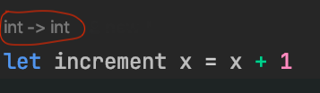
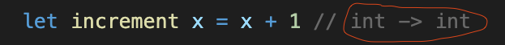

## Intro
There are plenty of great resources for learning F#. I have no intention of throwing my hat in the ring. However, there were a few hurdles that I struggled with when I first started learning F#, and I've seen my colleagues struggle with many of the same things. So, consider this post a supplement to more comprehensive F# learning resources.

> If you're looking for such resources, I highly recommend [F# for Fun and Profit](https://fsharpforfunandprofit.com/posts/fsharp-in-60-seconds/) as well as the [F# Software Foundation](https://fsharp.org/learn/).

## Beginner's Mind
When I started learning FP, I really struggled. I'd been doing imperative and OO style for years, and I kept trying to apply the same ways of thinking to FP. It's human nature to hold on to the strategies that have worked for us in the past. It's like the old adage:

> When you're holding a hammer, everything looks like a nail.

[comment]: <> (Luckily, I was able to stay motivated because I'd seen the benefits of functional programming first hand when I did a hackathon with an FP devotee. They were able to solve seemingly complex problems with such ease that I became convinced there might be a better way of doing things than what I'd learned.)

Once I was finally able to grasp FP, I was surprised at how simple it was. In fact, I think beginners would have an easier time learning a language like F# than C#. If you think back, you didn't always think in an OO or imperative way; you learned to think that way through learning that style of programming.

So, if you're expecting F# to be C#, then you're going to be constantly frustrated. But you were probably frustrated when you first learned C#, because that style of thinking was new to you then.

[comment]: <> ([POP]I had a colleague who argued that it shouldn't be called F# because it didn't feel at all like C#. But the argument isn't cogent: by the same standard C# shouldn't have the 'C' as switching between the two languages is really jarring. There aren't even classes in C! Furthermore, I'd argue F# and C# have more in common than C and C#. Both are .Net languages, can use all the base libraries, and they are bidirectionally interoperable. So, the name seems pretty apt to me.[/POP] )

So, start with a beginner's mindset. Pretend you know nothing.


I think you'll find that once you start thinking functionally, *most* everyday programming problems become easier (and more fun) to solve.

## No Need for Variables
In imperative languages, unless you use a specific keyword, variables are _mutable_ by default:
```csharp
var person = new Person { First = "Jon", Last = "Snow", Age = 13 };

// Happy Birthday Jon!
person.Age = 14;
```

In functional languages like F#, it's the opposite. Unless you specify otherwise, the default behavior is _immutable_:

```fsharp
let person = { First = "Jon"; Last = "Snow"; Age = 13 }

// Happy Birthday Jon!
person.Age = 14     // bool = false
```

The line `person.Age = 14` will not reassign the value, but instead evaluate to `false` as the values on the left and  right of `=` are not equal. If we wrote, `person.Age = 13` it would return `true`, but still wouldn't reassign anything.

In imperative code we think of a variable declaration as placing a value in a named slot of memory. E.g., `var x = 5` means _take an open slot of memory, label that slot "x", and put the value 5 in the slot_. Later we can place a different value in that slot and the variable "x" will be "re-assigned".

In contrast, in functional programming, we think of `let x = 5` as _binding_ the name "x" to the value 5.[POP]For this reason statements like `let y = 6` are called _let bindings_.[/POP] You cannot reassign the value 5! The value 5 is just 5!

Now you might have two thoughts at this point:
1. Sometimes data changes; how do I represent that in F#?
2. Why would I want immutability?

#### 1. Handling Data Changes
The way functional programs "update" data is by copying the data into a new object with any desired alterations. Now, this might seem like it would be tedious, but because it's such a common operation functional languages like F# have built in language constructs for doing it. For example:

```fsharp
let jon = { First = "Jon"; Last = "Snow"; Age = 13 }

// Happy Birthday Jon!
let olderJon = { jon with Age = jon.Age + 1 }
```

This is called a _record copy_ expression. It's simple, concise, and safe. [POP]You might worry about the performance of coping data in this manner. Well, as it turns out, these operations utilize binary trees to make themselves very efficient.[/POP]

#### 2. The Value of Immutability
No race conditions! Immutable objects are inherently thread-safe! This is especially important with the ubiquity of asynchronous code in modern programs.

Furthermore, programs that use immutable values are easier to reason about. For example, if you're trying to understand a complex loop that updates the values of some variables, you have to keep track of the variables in your head as you think through the behavior of the code. What a headache!

Additionally, a mutable variable might get changed, say by third party code, in a way hidden from the client code, leading to unexpected errors. For example, consider the following code:

```csharp
// Third Party Code
public void PrintName(Person person)
{
    Console.Write($"{person.First} {person.Last});
    ++person.Age;
}
```
A caller of the `PrintName` function would not expect the `Age` field to have been re-assigned. (Of course, it's unlikely anyone would write code so blatantly misleading, but accidents happen.)

In F#, not only would `person` be immutable, it would also be passed to the function as a _value_ rather than a _reference_, so the function wouldn't even be operating on the same "copy" as the caller.

## No Need for Loops
You might not be able to imagine a program without `for` and `while` loops --- they are bread and butter in imperative languages --- but I assure you, problems can be solved without them, and you'll end up with code that it much easier to reason about and modify.

In fact, C# already has a library, `Linq`, that borrows the functional way of solving problems. Compare the two styles of coding below:

#### Imperative
```csharp
var people = new List<Person> { ... };
var shortNames = new List<string>();
foreach (var p in people)
{
    if (p.Age > 13)
    {
        var fullName = $"{p.First} {p.Last}";
        if (!shortNames.Contains(fullName) && fullName.Length < 10)
            shortNames.Add(fullName);
    }
}
```

#### Functional / Declarative
```csharp
var shortNames =
    people
        .Where(p => p.Age > 13)
        .Select(p => $"{p.First} {p.Last}")
        .Distinct()
        .Where(n => n.Length < 10);
```

Which style is simpler to write? Which style is easier to read and understand? Which style would be easier to modify and extend? In which style would it be easier to notice logic errors? Most people would say the _declarative_ style is better on all counts.

Before `Linq`, F# used _pipes_ to the same effect:
```fsharp
let shortNames =
    people
    |> Seq.filter (fun p -> p.Age > 13)
    |> Seq.map (fun p -> $"{p.First} {p.Last}")
    |> Seq.distinct
    |> Seq.filter (fun n -> n.Length < 10)
```

While `Linq` is wonderful, it only works on collection types. In contrast, F#'s _pipe_ operator can be used to create fluent apis out of anything! (For more on _pipes_, see "Partial Application for Fluent APIs" below).

## No Return Statements
There is no `return` keyword in F#.[POP]Except for *computation expressions*, which are *really cool*, but unfortunately outside the scope of this post.[/POP] Instead, the value of the last expression evaluated by a function is returned:

```fsharp
let increment x =
    printfn $"The number is %i{x}"
    true = false
    x + 1 // <-- what is actually returned
```

When you think of it, in other languages how often do you write code *after* the `return` statement? I'd wager it's rare. So F# spares us from unnecessary boilerplate. Additionally, it ensures that every function has a return value. In fact, all functions in FP take in and return a value, which has many benefits (more on that below).

## The Unit Type
There is no `void` or `null` in F#. The closest analogue is the `unit` type, which has exactly one value, `()`. So, if you have a function that doesn't need to take in or return any particular value, you can use the `unit` type.

```fsharp
let foo () = ()     // unit -> unit
```

However, it's important to note that `unit` is not the same as `void`. `void` is neither a type, nor a value. In contrast, `()` is a value of type `unit`.

Nor is `unit` equivalent to `null`. A `null` value can be *any* reference type.
```csharp
string foo = null;
List<int> bar = null;
Task t = null;
```

The existence of `void` and `null` means there are many edge cases that have to be handled in special ways. Null values are particularly sinister, as Null Reference Exceptions are among _the most common type of runtime exception_. [Tony Hoare](https://www.infoq.com/presentations/Null-References-The-Billion-Dollar-Mistake-Tony-Hoare/), who created the first `null` value back in 1965, said of it:
> I call it my billion-dollar mistake…At that time, I was designing the first comprehensive type system for references in an object-oriented language. My goal was to ensure that all use of references should be absolutely safe, with checking performed automatically by the compiler.
But I couldn’t resist the temptation to put in a null reference, simply because it was so easy to implement. This has led to innumerable errors, vulnerabilities, and system crashes, which have probably caused a billion dollars of pain and damage in the last forty years.

So you can see how omitting null and void in functional languages can spare you from many headaches.

(For more on the perils of `null` [see this post](https://hackernoon.com/null-the-billion-dollar-mistake-8t5z32d6).
If you're wondering how you represent the concept of _nothing_ without `null`, see this post on the [Option Type](https://fsharpforfunandprofit.com/posts/the-option-type/)).


## Pay Attention to Types
F# is a statically typed language. However, most of the time you don't need to specify types (explicitly). So you could write...
```fsharp
let increment (x: int): int = x + 1

increment 5    // int = 6
```
As...
```fsharp
let increment x = x + 1

increment 5    // int = 6
```

And the compiler will figure out from context what types are in play.[POP]There are some circumstances where the type is ambiguous, and so you must specify it explicitly. E.g., if two record types `A` and `B` each have a field, `name: string`, and your function only invokes the `name` field, the compiler won't be able to determine whether the type is `A` or `B`. Alternatively, you can make a function generic when you intend it to be usable on all the types causing ambiguity.[/POP] Because of this, it is often easy to overlook type signatures, which reveal important information about the objects you're working with.

Now, even though types can be implicit, if your IDE supports F# then it often will show you the types you're working with. Note the type signatures (circled in red) displayed by the following IDEs:

#### Rider:



#### VS Code:



Paying attention to these types will make understanding and modifying your code much easier.

### Use Types to Understand Function Signatures
Something that often causes confusion is how function signatures are denoted. It's easy enough to understand in the case of a one parameter function. For example, the `increment` function above has a type of `int -> int` which you can read as "this takes an `int` and returns an `int`".

Where people are often thrown off is when you have multi-parameter functions:
```fsharp
let add x y = x + y   // int -> int -> int

add 3 5    // int = 8
```

The `add` function has a signature of `int -> int -> int`. This notation seems confusing until you understand *why* it's written that way. Then it is quite intuitive.

The first thing you have to understand is that *all* functions only have one parameter...

But wait! What about the `add` function above? Clearly it has two parameters!

Well, the way the `add` function is written above is just syntactic sugar. What the function *really* looks like under the hood is:

```fsharp
let add x =           // int -> int -> int
    fun y -> x + y
```

So, when you read `int -> int -> int` you should see it as `int -> (int -> int)`.[POP]This is known as [currying](https://en.wikipedia.org/wiki/Currying). [/POP] That is, `add` is a one parameter function that takes an `int` and returns a function of type `(int -> int)`. So, when you appear to be passing a second argument to `add`, you're really passing it to the function that `add` returns.

"But", I hear you say, "that's just arbitrary! Why limit yourself to single parameter functions?". Well, it's actually quite useful, as I'll show in the next section.

### Using Types to Understand Partial Application

#### Partial Application for Polymorphism
Since passing the first parameter of a multi-parameter function gives you a new function, you don't have to pass all of a function's arguments to it. This allows you to build new functions out of old ones, essentially giving you the equivalent of polymorphism in OO. Check out the examples bellow:

A simple example:
```fsharp
let add5 = add 5    // int -> int
let add9 = add 8

add5 3    // int = 8
add8 3    // int = 11
```

A more interesting example (pay close attention to the types):
```fsharp
type Logger =
    {
        Log: string -> unit
    }

let consoleLogger = { Log = Console.Write }       // Logger
let mockLogger = { Log = fun _ -> () }            // Logger

let addAndLog logger x y =                        // Logger -> int -> int -> int
    logger.Log $"The sum is: %i{x + y}"
    x + y

let addAndConsoleLog = addAndLog consoleLogger    // int -> int -> int
let addAndMockLog = addAndLog mockLogger          // int -> int -> int

addAndConsoleLog 5 3    // will print "The sum is: 8" and return 8
addAndMockLog 5 3       // will print nothing and return 8
```

Compare this last example with polymorphism in an OO language. You would have to define an abstract base class, and then two additional classes that implement the base class. Generally, that involves (at least) three different files and a lot of boilerplate. In F# we were able to achieve the same thing in just a few lines of code.

#### Partial Application for Fluent APIs
Another useful feature of partial application is how it enables fluent APIs when combined with the pipe (`|>`) operator. The pipe operator is defined as...
```fsharp
 let (|>) f x = f x
 ```
...which enables you to pass parameters into a function from the left, like so:
```fsharp
3 |> add 5       // int = 8
```

Which admittedly looks pretty goofy on its own. But, check it out in a more common context:
```fsharp
[ 1; 2; 3; 4 ]
|> List.map add5                    // int list = [ 6; 7; 8; 9 ]
|> List.filter (fun i -> i < 8)     // int list = [ 8; 9 ]
|> List.sum                         // int = 17
```

This is very similar C#'s fluent API for collections, LINQ:
```csharp
var myList = new List<int> { 1, 2, 3, 4 };

return myList
    .Select(i => i + 5)
    .Where(i => i < 8)
    .Sum();
```

What's nice about pipes and partial application, is that they are completely generalizable, whereas LINQ only works with lists. For example, here's an F# function that goes between multiple types using pipes:
```fsharp
"I love F#"                 // string
|> String.split " "         // string list = [ "I"; "love"; "F#" ]
|> List.map toLower         // string list = [ "i"; "love"; "f#" ]
|> String.concat "_"        // string = "i_love_f#"
|> String.length            // int = 9
```

In C#, you *can* create fluent APIs for types other than collections by writing extension methods for each type. But that requires _a lot_ of boilerplate. In F# you get fluent (or declarative) apis for free right out of the box.


# Candidate Topics
- File Order Matters
- Decomposition and Pattern Matching
- Left Associativity
